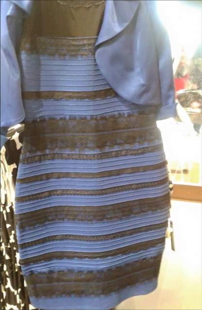

# More Memory

Easter candy! WOOHOO!

So, the week's most pressing issue:

Basically, the same shades can look like different colors because your brain automatically corrects colors. Your brain sees the image, it uses the top down processing we learned about to correct the color, and we see corrected colors. Since it was nearly impossible to see if the dress was lit from the front or behind, different people (and the same people at different times) corrected to different colors. Don't blame the dress, blame top down processing!

Now, on to the lesson. The fun activity we did last week confirms that it took longer to mentally rotate objects while holding real objects, which confirms we use the motor center to mentally rotate things.

Also, **SIGN UP TO BE A GUINEA PIG**. Do it, or you'll have to do a final paper!

## Transfer to Long Term Memory

OK, so we concluded last week that memories that have more links to other memories are saved more often. We also talked about the buffer, which deletes and refreshes ever 200 milliseconds or so, and working memory, which only stores things that are actively being used, kind of like RAM. So, how do we move things from working memory to long-term memory? Well, if you'll remember from last week, you need to form links and connections, which is why we can remember long and pointless stories, and why we never forget songs, and why memory aids work.

The first main study that examined it was by 2 people named Hyde and Jenkins in 1973. Volunteers were split into 2 groups. People in group A were asked to just go through and look for if the word had the latter "A" or "Q" in it. People in group B were asked to rate how nice they found each word. As a surprise to no one, group B vastly outperformed group A in an unexpected memory test at the end. Interestingly enough, being informed of the test beforehand made almost no difference, so it doesn't help that you *want* to rmember stuff for an exam, your brain doesn't let you decide what it stores.

Next was a study in 1975, that gave 4 groups three different tasks:

* Physical Structure (Is the word uppercase?)
* Phonics (Does it rhyme with another word?)
* Semantic (Does it fit in an example sentence "She cooked the ________"?)
* Advanced Semantic (Does it fit in an example sentence "The lobster swooped down and carried off the ________"?)

Not only did performance improve from groups 1-3, but people remembered better with the harder sentence as well! SO what does this mean? In 1979, a study showed that people remember the same sentence much better if it's upside down. This seems counterintuitive. We know just rehearsing for longer doesn't help with memory. At this time, connectionism was in vogue, and people guessed that the ease of remembering had to do with forming connections. Evaluating a rhyme makes a few connections. Imagining a sentence takes more. And imagining a specific scenario of a flying lobster, or reading letters upside-down causes a lot of connections, just because the experience is so weird.

This ties into the neural net theory, and the idea that if you want to remember something, you need to connect it to as many memories as possible. This is why people think it's a good idea to chew gum in the library and in the test instead of actually studying. The theory does have some validity, but you'll need more connections to the information you need to remember than just the taste of wintergreen, or whatever kind of gum white girls eat. (The Canada Goose girl next to me is chewing this vile smelling cinnamon gum, and my brain is probably going to associate the memory with the next time I eat Cinnamon Toast Crunch in the dining hall. But I digress.)

So what if there are no links? Like if you meet someone and learn their name, for example, and there's no reason that you should give a shit, so you toss their name out of memory. Then, once you learn things about them you can associate, you need to relearn their name before storing it permanantly.

Well, you can do what [Michael Scott does](www.youtube.com/watch?v=KQfW1G6Me5E). Yeah, it's rude, but it's the only real way to do it. You have to associate a fact with deep processing and an elaborate experience, or you won't know it. This is why I've learned more Japanese from *Gaki No Tsukai* than my textbook. Something's funnier about learning でございます from Tanaka getting whacked in the balls than my Japanese class. It's also why you learned some basic German super duper fast, even after spending just a few days in Berlin. Because, really, the fact that you can still instantly know what *Wollen Sie eine Karte zum der S-Bahn und eine Hanoverische Wurst?* means is testament to the fact that this system works.

So what about people who have inhumanly good memory, like people who know 50,000 digits of Pi, or those people who can instantly play any classical music instantly. Well, let's look at chess grandmasters, who seem to know the whole game, or coders like Richard Hendricks who can instantly bring ideas to life in code. Well, in 1965, there was a study done that showed that chess masters and novices both suck at memorizing randomly paces chessboards (only about 5 pieces). But put a chessboard out like it's in the middle of the game, and while we can still only remember 5 pieces, they can now remember 20. So something's different. If we track eye movements, we find that novices look at the board piece by piece, at specific locations. Chess grandmasters will look at the board, see a tactical configuration as a whole unit, and be able to plop the pattern back down. We can't see these tactical patterns, because we haven't been trained and aren't Russian.

So, there was a perverse experiment done in the 1980's on one work study student, who we know as SF. He was a sophomore, juggling school, clubs and a job, with average grades. For a year and a half, one hour a day, he had to take a test. He would Hear a list of random numbers, 1 per second. It was his job to repeat back the list. If he was right, the next list had one more number, if he was wrong, the next list had one less. The list was new every time. 50% of the time, he would be asked how he did it. Over the course of the year and a half, he goes from an average memory span of about 7 numbers to an average span of around 80 numbers. Not bad for a year's work. When asked how he did it, he said he made mnemonic associations, for example "3 4 9 2" would become "3:49.2 seconds, near the world record for a mile.". "8 9 3" would become "89.3, a very old man". He would then imagine that old man running the mile. Interestingly enough, while he was great with numbers, he never got any better with *letters*. All he did was practice with numbers, so his training seems specific. As time went on, though, his "chunks" of numbers got enormous, hence the 80 number strings. We can verify this experimentally by asking him to remember numbers in different groups, just like it tales you less time to rmember "ABC" than it does "DEF". "ABS" is in one chunk of the alphabet song, while "DEF" spans 2, so it takes you longer. Neat, huh?

Your brain does this grouping stuff all the time, not just with lists of letters and numbers! It's why you can't really remember **EHTCTADHASECHTEGDO**, but when we shift the letters slightly to **THECATCHASEDTHEDOG**, you have no problem at all!

This is why we get a new view of working memory. It's not a place like RAM, but rather a system for maintaining currently active memory traces. The neural basis of this is fairly complicated, with storage and manipulation all over the brain. Visio-spatial working memory, the stuff that doesn't use network connections, seems to use a part of the brain we associate wih storage and spatial perception. Interestingly enough, it lights up on the left side when we do spatial memory, the left side when we do verbal memory. Interesting...

## Semantic Memory

OK, so apparently "please pass the candy" isn't as understood here as grabbing the bag like you're fucking 4. Seriously, it's like a free for all. Ah, whetever, I have some peanut butter cups left over in my dorm.

So, semantic memories. Basically, everything you know about objects, and events, and people and stuff in the world. There are 2 main theories as to how they work:

* **Abstraction Theories**-Semantic memories are generalizations of episodic memories. This implies that there are 2 distinct memory systems. Over a handful of exposures, your brain can group similar experiences under one word. Once you've seen a lobster 5 times, you've seen them all, and can generalize under the word "lobster" without specifically keeping track of every time you've seen one.
* **Instance Theories**-Rather than making a dictionary entry, your representation of "lobster" is nothing but the sum of all your experiences of lobsters. You have lots of experiences and you keep them all without abstracting them away.

### Abstraction Theories

So, there's a lot of support for abstraction theories. There are documented cases of unusual amnesia, where the person is unable to name specific fruits or musical instruments. This suggests damage to the temporal lobe, and a memory system that loves to make generalizations and abstractions about the world. There was also an experiment run where, after sitting in an office for 10 minutes, people happily said "yes" to "was there a desk?", which there was, but also "were there books?", which there *weren't*. Their brain put the books in the academic office, just because they thought they should be there! This is super useful for filling in holes left by blinking or sneezing or looking away. We also use these schemas and scripts all the time! I can describe my day in a few sentences and your brain just automatically fills in the normal stuff for you until you have 10 hours of memory conveyed in just a few sentences.

To test this, researchers came up with a model in which your brain stores vague, general types, not specific occurences. In this model, things are stored in a hierarchy, just like an organized file sysrem. This follows what's called the *principle of cognitive economy*. Store things hierarchically, and store things in the most general terms possible, leaving sub-objects to fill in the details. This is exactly what object oriented programming languages, like Java and Python do! For example, "hooved animal" is a subclass of "animal" and has the subclass of "mammal", etc. So, the model works like a hyper-optimized Java program. (Yeah, yeah, I know Java is slow as shit no matter how much you optimize it, but just go with the example and blame the JVM.) So, by that logic, you should be able to answer simple/specific questions much faster than general ones where we have to work our way up. So I should be able to answer "is Rarity in the Mane 6?" tens of milliseconds faster than "is Rarity a pony?". Or "what color is Hatsune Miku's hair?" should go much faster than "what country is Hatsune Miku from?".

### Instance-Based Theories

Quick! Think of a vegetable! Now think of a tool! Now think of a prime number! You probably said "carrot" first, just because you've been exposed to them more than, say okra or some hippie shit. And you probably said hammer for the same reason. And you probably said 7 or 3 rather than 13.

The point of this is if you *did* have an abstraction theory dictionary entry, you should have picked some veggie randomly, yet we all seem to pick carrots. It also explains why, even though it's no less or more of a prime number than 5, you still think 131 is a shitty example of a prime number, even though that makes *no mathematical sense at all*. In 1972, researchers pointed out that the question approach is biased. Of course I make the connection between Hatsune Miku and green pigtails, or Hatsune Miku and Japan. Those are obvious! An I going to think about how Miku was originally designed to work on 8086 chips or that her voice samples were provided by Saki Fujita? Probably not. So they redid the experiment. Under the old idea, I should associate cows with hooves faster than I associate them with milk, but it's the other way around! There's an associative shortcut!

In addition, it's not just that things can be good examples, but some can be shitty examples as well. Plus, there are edges! Are the "cups" at the Viand cups or bowls? Because they're a bit big to be cups, and a bit small to be bowls. So they're a shitty example of both, and we can very easily push it into one boundary or another, just based on how we see people use it. Are they drinking from it or eating from it? Wittgenstein did this too, when he tried to define a game. Does it have to be fun? No, because Russian Roulette is a game. Does it have to be competitive? No. Does it have to involve skill? No. Luck? Not neccessarily. So Wittgenstein concluded that a "game" had no necessary features, only a "family resemblance", with no clear boundaries. Things just fade from good examples to shitty examples, and we're not sure where the boundary of the set is, or if it even exists at all.

If that's freaking you out, there's a theory to explain it. The theory says that we represent concepts as central tendencies of features, features that never really change. Features can be combined to form a resemblance, of course, there's not one single feature that ever bird, or game or lobster ust have. The more shared features there are, the better of an example we think it is. Wittgenstein called it a "family resmblance". Most games are fun, most are competitive, etc, and games that have more of those features, like poker or basketball, are seen as good examples, while games with fewer traits, like diplomacy or Russian Roulette are seen as shitty examples. And all of these are built from direct experiences, which explains why Americans are *much* more likely to associate cows with milk than our friends in Europe who don't drink it as much because they're busy making cream and butter instead.

So, are absraction theories right? We need schemas to fill in gaps in memories, and we know things are organized hierarchically, too. But, instance theories must be right, too! We can't define concepts and fuzzily associate to form sets. It seems they're both right, so we need to make the work together. We do have these definitional features, and even when we can't draw perfect boxes around these categories and concepts, we use them to quickly use logic on these categories. When we use concepts, we're using instance based sorting. But for logical reasoning about concepts, we slap on the labels.

Think of a fish, like a salmon, for example. What are its features? Now think of a pet, like Cleo, for example. What were his features? If you only had firm, logical definitions for "pet" and "fish", thinking of a "pet fish" would be a snap. If you only had these strange boundaries, you might think of something weird that has characteristics of  both a fish and a fuzzy cat. Like a 4 legged fuzzball on a bagel, or a whiskered sushi, Or...

***OH, MY GOD.***

So, normal people, possibly not us, have both. There are definitions we use, and prototypical features we use to identify, marrying the 2 approaches. So, if I was asked to find a grandmother, I would know that the definition entails having a child with children, but I would look for someone who is old, or has glasses, etc.
