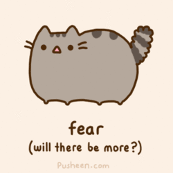

# Pattern Recognition

The reason we're talking about symbolic approaches and all that jazz is something called *pattern recognition*, and this is the holy grail of cognitive science, everything from computer vision and AI to neurobiology. So, to start, what is pattern recognition? An accepted definition:

> Pattern recognition is a process whereby a perceptual event is compared to prior experiences and categorized as belonging to a particular type of object, state, etc.

Or, a better way to express it:


So, we know that the brain has many diffrent modules, each of which take input and produce output. Remember Type 1 and Type 2 theory from last week? Let's revisit Type 1. THis theory just says that the mind uses set rules to manipulate set symbols, like what we do when we code. Remember that this is *bottom-up*. So we recognize shapes, find matches to letters, find matches to words, find matches to meaning, etc.

When we try to do this with vision, we do something similar. We find the smallest unit, build patterns, etc. Last lecture, we got up to ganglia, which can recognize contrast. To get to the next level, which is edge finding, we need to know about what's going on in the primary visual cortex, located in the Occipital Lobe. So, how did people find this out? The function was discovered in 1962, by Hubel and Wiesel. Methods like MRI and TCS are crude at best, but we're not limited to these crude and humane methods when we use... CATS!



So we anesthetize the cats, show them pictures of basically random shit on a screen, and scan what's going on in their heads using a very painful microelectrode, but whatever, it's a cat. No matter what they tried, though, the cats didn't give a shit. (Well, they are cats...)  After months and months of trying, they found their breakthrough by accident. As they were pulling the slide *out* while the light was still on, the cells in the Primary Visual Cortex went nuts. After further experimentation, they found that most of the cells in there detect straight lines. That's it. Some detect vertical lines. Some detect horizontal lines. Some detect 45 degree lines. Some detect 156 degree lines. That's it. That's all they do. And of course each line detector is basically made of a stack of ganglia. See how we're working our way up?


God, my jokes are awful. What's important to remember is that these aren't all edge detectors. Since some have firmware that detect color and motion, most neurologists refer to them as *feature cells*

This works with people, too! We just played a game showing that that I can't type out, but basically the gist is that finding a simple red thing takes constant time, as does finding a simple horizontal thing. Finding something both red *and* horizontal requires cells to talk to each other, giving us a *linear* search time!

## Gestalt Principles

These are basic rules that our feature cells follow to group things once we have lines, that were found in the 1920s and '30s in Germany. These are:

### Proximity

```
|| || ||
|| || ||
```

We see 6 lines at first, not 12.

### Similarity

```
XXXX X*X*
**** X*X*
XXXX X*X*
**** X*X*
```

We see rows on the left, columns on the right.

### Smoothness
```
\__/_
 /    \
```

We tend to see curved lines intersecting as 2 lines, not 4.

### Closure

We can identify:

```
---- -----
```

as one line, not 2.

These rules are the basic symbols that allow us to put together objects! Makes perfect sense, right?

Unfortunatley, like most scientific endeavors Germany funded in the 1930s, there's something really wrong with the Gestalt rules. And that is, where do we draw the line? When do we decide "OK, we found the letter?" Look at this:

```
    /    \ 
   /      \
  /--------\
 /          \
/            \
```

Is that a shitty "A", or a shitty "H"? Because if we put it between a "C" and a "T", I'd see an "A". A "T" and an "E"? You'll see an H.

However valid the Gestalt rules are, here's clearly something more than a strict, rules-based approach.


Sorry, Germany. You were only half-right here. (Although, given what else you were up to in the '30s, that ain't bad.)

The context problem shows up in audio, too! The same sound can have multiple different meanings depending on when we hear it. (A cough in different sentences, for example) The best example is written language. Take the following 2 sentences.

> The boat ran into the bank.

> The robber ran into the bank.

Literally one word for context changes the *entire* meaning of pretty much every word. And while we're on the subject of banks, if we look at this sentence:

> He put a check in the box.

You probably imagine someone putting paper in a safe deposit box. Right? That's it!

...I bet you didn't even think of someone checking a box on a form, did you? Boom.

## Top-Down Processing

This theory posits that we start with bigger constructs, and fill in the details. This is what context is. We use this all the time! We compress our speech, slurring our enunciation, and then the listener fills in the gaps to make the words! This is why creating DragonDicate was such a pain. A lot of our language isn't spoken, but rebuilt in the brain. There's another aggravating piece of evidence for top-down processing, which is when you have a big idea, say who a person is, but one of the details is missing. (Like a name, or an age, or where their stupid kids go to school.) And this happens all the time!

Here's this principle in action! If I say:

> I was on the bus and there was an accident because the driver was drunk.

You know it's the bus driver. That's grammar. But if I say:

> I was on the bus and there was an accident because a driver was drunk.

You know it *isn't* mine! Even though, gramatically, it could be! Fancy, no? The reason this works is because when I say "the bus", you instantly build a virtual one and know that the driver *must* exist. This is why you can recall everything about an actor, (He did this, he has this hair, he looks like this other guy.) but not need his name to look these details up and end up Googling stupid shit like "silicon valley curly hair guy". This means that we don't need to start at the bottom and work our way up. There must be some other way to get in and access the information. And this is where *connectionism* comes from. The idea that there's a network of information, and that everything is linked together. In order for this to work, you need something called "Spreading activation". The idea that when you activate a piece of information, it flips on things that are related to it. So, for example, if I ask you to think of "lobsters", that activation spreads to "Massachussetts", "Big Lobs", "stuffed", "lobster roll", "Legal", "cute", farther and farther out, until the idea dissipates and dies until I bring it up again. Another good example:

> Say a fruit that starts with A.

Good. It was "Apple", wasn't it?

> Say a fruit that starts with B.

Chances are you came up with your second answer (probably "Banana") much faster, and that's because the "fruit" idea is already activated. Neat, huh?

### Neural Networks

All right, here we go! A neural network node basically has a bunch of inputs and one output, as well as an output threshold. If enough of the inputs fire, (and some of them have more weight than others) the node fires. So, if I say "cat", you say "dog", because the connection from one to the other is super strong, and it fires immediatley. There are negative weights as well. For example, if I mention someone who was on "Girls", connections fire to Lena Dunham. If I mention someone who was on "Girls" who doesn't live in Brooklyn, negative connections are fired at Dunham, and the activation path is redirected to someone else, say, Allison Williams. When these connections lose weight for whatever reason, we can lose track of people's names, schools, whatever, while still keeping our other data about them, which we can then use as reminders to help us find our way back to what Dunham's name is without resorting to Google.

#### Training a Neural Network

Ideally, we want things that go together, like cats and lobsters (I have a problem, OK?) to have strong weights, and things that don't go together, like North Korea and food, to have negative weights. So we start with all random numbers as weights, and ask the model a question. Since it's random, we get garbage. We then compare the answer to the truth, and adjust the weights accordingly. After a few hundred thousand iterations, the network starts to get it. The memories we have, are therefore all in the weights. Knowing that "lobster" exists doesn't help unless it's connected to "fluffy". And if we ask you to say what comes to mind when you think of "lobster", you can quickly jump from "lobster" to "fluffy" to "flu" (I SWEAR, IT MAKES SENSE TO ME. I HAVE A WEIRD NETWORK.)

#### Context Effects in a Neural Network

All right, let's return to the shitty A/H thing. If we see it between a C and a T, our C and T nodes light up. The weird thing partially activates both the A and H nodes, and we're not sure what to do. So C, H, and T go up to the "CHT" idea, which doesn't really connect to anything, so that trail dies. But C, A and T go up to the "CAT" idea, which lights shit up like a Christmas tree. The affirmative signal is passed down, and we interpret the letter as an "A".

### Problem with Connectionism

So, connectionism was all the rage, and people thought it could solve *everything*! Everything's going to be perfect, right? Unfortunatley, no. The first issue is that rules definitley exist. Take this:

> I wug everyday! I'm going to wug tomorrow! I ________ yesterday!

You know it's "wugged", but you don't have a "wug" node! So, there has to be a tense rule *somewhere*. Children learn that the past tense of "go" is "went" and use it perfectly, switch to things like "goed", but then learn to switch back. How do we explain this? Well, symbolically, it's easy. You hear "went" and assume it that way, then learn the "-ed" rule and internalize that and start fucking it up, and then you learn new rules for dealing with irregular words. Plain and simple. Connectionists have a much harder time explaining this, basically saying that you associate a bunch of shit, and you begin to make mistakes until all the weights have sorted out. Can you see the problem here? Aside from being stupidly complicated, some children usually don't even get negative feedback! And somehow, they pick these rules up passively from their environment, which neural networks can't really do. How do we learn when we're right and wrong? And how the flying fuck do kids do *this*?

> Child: "Where's Mommy?"
> Experimenter: "Mommy goed to the store."
> C: "No, she went to the store!"
> E: "Yeah, she goed to the store."
> C: "No, daddy! *I* say it that way, not you!"

Clearly, rules are a much more elegant explanation to the problem than memorizing practically every word. Connectionism has fallen out of fashion as a result.

The end result is clearly much more complicated than either of these approaches. But the fundamental concept behind connectionism, this idea of a spreading network of activation is obviously there. We don't have a Type 1 explanation yet, but this concept must underlie things. You need both bottom-up and top-down processing. We're just not entirely sure how. We have some kind of information processing software running, and it's probably symbolic and bottom-up. But the hardware it's running on is probabilistic and top-down. There are all these different modules running different domain-specific software packages all over the brain. We're not just super-sure about things yet.
