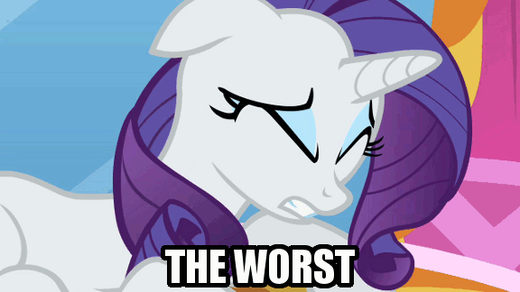

# Problem Solving and AI

All right, now that we're out of the memory unit, let's talk about problem solving and AI! Woohoo! A "problem" is defined as any attempt to reach a goal. In so-called "well-defined" problems, it's clear what the rules are and what the desired goal is. Most games work this way. Everything else is "ill-defined". Finding a satisfying career, for example is ill defined. You don't know the rules and you don't know the goal. In fact, most of problem solving focuses on turning these ill-defined problems into well-defined problems, because those are the ones that we can solve.

## Heuristics

The first theories of problem solving introduced the idea of a "Problem Space", a description of all possible moves and outcomes. We then search this space to find the goal state and learn what we have to do to get there. Now, the problem space is nebulous, and often unpredicatble and hard to search, but in well-defined problems, at least we can see all of it without searching. The place we are now is called the "current state", which we need to store in working memory. However, most problems, even well defined ones have dizzying amounts of possible states, way too many for working memory to hold at once. In chess, one of the classic scary examples, the amount of potantial game states is 225,000,000 after only 6 moves. In total, there are more than 10,000,000,000,000,000,000,000,000,000,000,000,000,000 possible games of chess, which would take this laptop about 1,000,000,000,000,000,000 years to map out. So, obviously, Deep Blue needed to do something different. One of the first things we do is toss out the need for algorithms *for now*, and replace them with these things called *heuristcs*. While algorithms are rigid rules that must always be obeyed, heuristics (often called "heuristic algorithms") are quick and dirty rules of thumb that can make a few mistakes, but generally get things right. Taking much less memory, this is what Deep Blue did, and what we do all the time. (We actually use heuristics far more than algorithms, just because of space and ease of running.)

### Difference Reduction

The simplest and most famous heuristic there is, which basically says that any move should bring us as close to the goal as we can. Look only at the states immediatley adjacent to you and move to the one that looks the most like your goal, regardless of what's next to you. If this sounds familiar it's because it's a breadth first search. and for this reason, a lot of basic AI algorithms use data structures like tries and binary trees because breath first search is so much faster on these structures. (If you don't remember why, reread your COMP15 notes.) Breadth first search also has the advantage of being super-easy to run concurrently. (If you don't remember this, **IT'S ON YOUR 40 FINAL, LEARN IT**) Since the brain is a concurrent machine (lots of things running in parallel) it can run this rule very efficiently, and as a result this AI (just I?) algoritm is very commonly implemented in ou brains, and it's how we solve most problems. Many common logic puzzles and brain teaser are hard because they *require* your brain to break this rule, which it really doesn't want to do, and switch to harder heuristic methods.

Difference reduction is the underpinning of all "greedy" algorithms, like Dijkstra's algorithm from COMP15! (That's the GPS one.) And it works fine a lot of the time. But what if the problem has a "local minimum"? This means that there's a part of the problem where you have to get *farther* from the goal in the short run to attain it in the long term. This algorithm gets stuck, unable to move forward or backward because either way is percieved as a loss, and we can't use it anymore.

### The Simulation Heuristic

All right, story time! You find out that you missed the bus by 30 minutes and you're kind of screwed because you missed a really important appointment. Chances are you're kind of miffed. Miss it by 10 seconds?



This is what's called the *simulation heuristic*, and is another really common one. The easier it is to *simulate* the alternate reality, the more weight you give the loss.

### The Representatativeness Heuristic

If I were to tell you that one of my friends in Bronies-NYC is a cosplay fanatic who speaks Japanese and goes to cons on the daily, chances are you wouldn't expact he has a job at several major tech firms and helps run the Facebook hackathon scene, right?

That actually applies to *two* members of the group. If you were being logical, you'd assume that it would be very likely that I have tech friends who overlap. So why did you ditch logic?

Because they didn't seem *representative* of tech execs. You expect OctoCats from hackathon heads, not cat ears. You default to the heuristic, not the logic. This is also why stereotyping is so common.

## The Availability Heuristic

Consider 2 sets:

* The words in this document ending in "ing"
* The words in this document with "n" as the *next to last* letter.

Which set is bigger? And since you said "ing" endings, youre ***WRONG***.

**ALL WORDS ENDING IN "ING" HAVE "N" AS THE NEXT TO LAST LETTER.**

So how did you forget this basic rule of logic? Because you never thing about the second to last letters of words. "ing" has meaning as a tense modifier, so you think about it much, much more. Since more examples are readily available, you make the false assumption that more of those cases exist.

This heuristic also explains why many med school freshmen (and WebMD) develop symptoms and assume dengue fever or some horrible desease, just because so many examples are available. So that's why WebMD keeps saying everyone has cancer.

### Why Heuristics?

The thing is, all of these heuristic methods are right 99% of the time! But since they're not *always* right, we can abuse the loopholes and make you forget that "n" is the second letter of "ing". But why risk loopholes at all? The main answer is speed. Logic takes time. The second reason are these unintended side effects. There's no benefit to being torn up over being late for the bus by 30 minutes, but missing it by 10 seconds? You ain't doing that shit again.

## The Generalized Problem Solver

Imagine you're in NYC and you get a call from a certain little shit up at Tufts and decide you need to get to Boston ASAP. A purely difference reduction solution, or some other heuristic soluton would entail you just running out the door and sprinting north. Obviously you don't do this, because you know you need a car. So, something else has to be going on before these heuristics kick in. So you use some forms of means-end analysis.

If the goal state is realistically unattainable due to the difference being way too big, your brain finds the best tool to shrink the difference. So, you need a car. Suddenly, you difference has shrunk. You only need to find a car. How do you reach this new subgoal? You call the garage. Your subgoal is now getting to the garage. When you need to get to the garage, that's when you can use difference reduction and run out the door.

Of course, this should look very familiar to any CS student. It's recursive! For the benefit of people reading these, a recursive method is just one that calls itself. So, here's an example of recursive factorial function.

```python
def factorial(n):
   if n < 1:     #base case
       return 1
   else:
       returnNumber = n * factorial( n - 1 )     #recursive call
       print(str(n) + '! = ' + str(returnNumber))
       return returnNumber
```

Note that in order to solve the problem, we solve a smaller version of it until we can solve the version trivially (with heuristics, probably). This is called the "base case". Then we work our way out, using the smaller answers to create the bigger answers!

...I honestly just wanted an excuse to write some Python. I feel like I'm in 7th grade/10th grade/AP Java/COMP15 learning about recursion again!

As a result of everything being recursive, problem solving becomes a matter of locating the most effective tool. Memories for objects have functions associated with them in the neural network, allowing us to figure out how to use these objects as tools. This marriage of object and function is a hallmark of object-oriented programming languages, like C++ and Java. Turns out our brains are pretty good when it comes to good programming concepts. (This also may be why object-oriented languages are used in like, 95% of software development. It's really effective.)

## Are These Uniquely Human?

The question of whether or not this means-end recursive analysis is what separates us from the animals has been debated since their discovery. Many researchers say that animals use heuristics only, but are incapable of means-end analysis. In the 1920's, a study of chimpanzeesshowed that, when confronted with a banana hanging from the ceiling, apes are capable of looking around and using tools to climb up and whack the bananas down from the ceiling. Some even built tools out of multiple bamboo sticks and pole vaulted. This led people to assume that other animals were cpable of means-end analysis. But, was it means-end analysis. It took them around 3 years to develop these tools, and that could have very easily been the classical conditioning that works on your dog.

Another blow to the chimps theory happened when the study was replicated with different chimps and no bananas. Lo and behold, the same behaviors arose, even when there was no reason to do so. Oops.

The debate rages on for decades, and eventually, even committed researchers have backed away from this theory of apes being capable of means-end analysis.

### False Analysis

The reason this debate took so long was that even simple behaviors can look like this complex analysis. Even pigeons and squirrels in Central Park can show this. They've been rewarded with nuts and punished by wide open spaces (hawks), so the illusion of pigeons/squirrels being "smart" and performing complex analysis arises, even though it's just simple conditioning.

## Social Cognition

This kind of problem is so hard to solve, we often can't do it! Nonetheless, we seem to have an amazing aptitude for inferring social cues, and also seem to get weirdly better at problems when they become social analogies. This means we must have some sort of innate system to reason about social situations. Infants can immediatley detect dropped objects and return them, plus open doors for teachers as young as a year old. Not only is this innate, but it seems uniquely human; other animals do this, but will always selfishly evaluate their own goals first. Empathy seems to be something unique to young humans. Babies want to help their parents accomplish goals, until they become toddlers that is.

Our primate cousins use knowledge of the goals of others to help accomplish their own. We seem to use our knowledge of the goals of others to establish a joint goal that will benefit both of us. We also use eye contact to coordinate goals. In fact, lack of these innate mutually beneficial behaviors is so jarring, we see it as sociopathy and are innatley terrified by it, which is why we find characters like Frank Underwood so amazing.


Also, because chimps cooperate with us for their own goals, they get super frustrated in partners really fast, and almost never compromise their goals. Chimps also ruthlessly skip needless steps that may help others, but not them, and never teach each other, only copy for their own benefit. Young humans expect to be *taught* things. They expect that you're tying to *help* them, that your goal will benefit them, and will follow along with the expectation of mutual benefit, even if it's not apparent.

Humans also continually expect others to work together with them, which is why you often shop off the nose to spite the face. Sure, *you* got hurt, but the motherfucker who dishonored you and spat in the face of your shared goal gets hurt *more*! Take that, you ass! Chimps will accept any offer, no matter how unfair, so long as it benefits them in the slightest, while humans will often reject offers to "save face", even when it's batshit crazy to do so, just because we *believe* it will make the other person learn to act in the public interest next time.

...Apes are pragmatic assholes. That's basically what we're trying to say.
