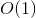
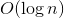
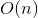
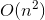
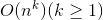
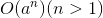

#Asymptotic Analysis

##Eclipse Tip of the Day - Debugging

Apparently, we don't know how the hell to debug code properly, so we're doing that now. So say you're writing some awesome code and Eclipse craps itself. Well, don't panic. Put a breakpoint on the line and click the "Debug" button. The debugger will stop on the first line. When you hit resume, it goes until you hit the breakpoint. Hovering over variables in your code on the stopped line will give you their values. THe upper window shows global variables. Be on the lookout for the "this" state. It shows all active memory use in the code. If you right click on a pointer to an array, you can have eclipse display it in a nice rray format for your lazy self to look at. FOr example, if you step through and your pointer's value is `0x0`, you know something is wrong. Even if you don't have any breakpoints, you can use "Step Over" to advance 1 line at a time. Or you can use step into on a function call to go through the function one line at a time. Boom. Look how easy that was. Do that in the future.

##Obfuscated C

LOOK AT THIS COOL THING:

[FLUID SIMULATOR](youtube.com/watch?v=QMYfkOtYYlg)

THAT WAS SO DAMN COOL, WASN'T IT? YOU SHOULD ASPIRE TO BE LIKE THAT. MOTIVATIONAL TALK OVER.

##Algorithm Analysis

So how do we determine the efficiency of an algorithm? Take your standard if-in-a-for-loop array scrubbing function. How do we determine how effective it is? Well, we could compile it into ASM and see how long each instruction takes. But that sucks and makes your eyes bleed and wastes time. Plus, today's machines optimize everything behind the scenes, which is annoying. So instead, we define what are called "primitive operations". These are things like assigning, adding, comparing, calling functions, returning, indexing, etc. and we define those to take 1 time unit. In 1950, 1 time unit was a tenth of a second or so. Today, 1 time unit is almost incalculably fast., like a millionth of a second or something. Now let's look at an example C++ function (example:

```C++
int arrayMax(int A[], int n)
{
  int currentMax = A[0]; //Executed once, 2 primitive operations, assigning and indexing.
  for(int i = 1; i < n; i++;) //Initializing i is one operation, the comparison happens n times, the increment happens 2(n-1) times.
  {
    if(currentMax < A[i]) //This comparison happens 2(n-1) times (it's in the loop)
      currentMax = A[i]; //At most 2(n-1) times
  } //Loop total: Between 4(n-1) and 6(n-1) operations
  return currentMax; //Only executed once
}
```

It's 2(n-1), not n-1 because indexing and comparing/assigning are seperate primitive operations.

Adding all this stuff up, we have an at-best efficiency of 5n and an at worse case of 7n-2. What's the average case? It's hard to say. Honestly, we didn't need to freak out over details that much. All that matters is that the time taken to complete `arrayMax()` grows proportionally to `n`.

###Big-O Notation

It's not exact, but it gives us a rough idea of how many time units the operation will take. Basically, if you run this program a million times, how will it behave? Certain functions are more efficient with tiny data sets than others, but once you see the big picture, these functions suck with any set of large size.

So when you calculate Big-O notation, find the biggest factor and dump the rest. The following table ranks functions in order of efficiency (and difficulty to obtain)

Function | Notation
---------|---------
Constant | 
Logarithmic | 
Linear | 
Quadratic | 
Polynomial | 
Exponential | 

Whenever you have a time efficiency composed of a multiple functions, just take the nastiest function.

Quadratic and polynomial functions often show up in nested loops. Searching is usually linear. Binary searches are usually logarithmic.
