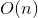

# More Tries

Let's look at our letter tree

```
         ROOT
  /  |   |  |  |  \
 /   |   |  |  |   \
 C   D   F  P  R   S
 |   |   |  |  |  / \
 O   A   I  I  E  A N
/ \  |  / \ |  |  | |
R  W*Y  R*S T* D* N O
|       | | |     | |
N*      E*H*S*    D*W*
```

Again, asterisks denote word endings. The awesome part about this tree is that finding a word is extremley simple from line to line, so the cost of looking up the word is fixed. This means:

* We never go above the length of the word, so we have constant time lookup!
* The maximum length is not based on the size of the dictionary
* No need to balance!

They do take up a lot of space, though.

We can compress a trie, too! We can compress things that are just chains with no further branches:

```
                     ROOT
   /      |        |           |       \        \
  CO     DAY*      FI        PIT*S*   RED*       S
 /  \             /  \                          / \
RN* W*         R*E*   SH*                    *AND *NOW
```

This idea of compressing commonpatterns should look familiar to you; you implemented this in an LZW algorith at CodeDay NYC all that time ago! (Pied Pipeeeeer...)

## Searching a Trie

This is similar to searching a binary search tree, except we can make it faster, because we know the order of the characters on the ASCII map! Each node keeps its childrean as an array, so...

```c++
node* node::findChild(char c)
{
	return children[c-'a'];
}
```

Boom.

It's also easy to do localized searches around a point, which is how your phone knows how to recognize your typos and make you not sound dumb.

# ???

# Unix Tip of the Day

Remember how we were talking about how spell check uses tries? Well, did you know your shell has a SPELL CHECK?


Yep. `aspell`. Use it. Also you have a dictionary in `/usr/share/dict/words`. Yay!

# Priority Queues

Sometimes we want to store data in a prioritized way. Like, in an emergency room, or office hours, or getting on a plane, or whatever, it doesn't matter what the order is. The priority is seperate. A *Priority Queue* stores elements according to priority, not in a particular order. There's no longer any notion of position.

Applications that use these commonly require comparing objects according to a key, like boarding pass number, or con badge color, or how horse famous you are, or what have you. Keys can also change midway through the task. You can sort restaurants by stars and dollar signs, for example. Your priority can also be changed. Keys can also be generated based on multiple values, and that's the job of the programmer. These keys can be generated by a property of the object like price, or by an external tagging program. For example, BronyCon will give you a priority badge based on how much you pay, but you only get the ribbon if you're externally evaluated as horse famous. Sorry, priority buyers.

There are 2 self-explanatory rules for comparison for keys.

* If `(k1 <= k2 && k2 <= k1)` is true, k1 is the same as k2.
* If `(k1 <= k2 && k2 <= k3)` is true, k1 <= k3.

Follow these and you will never have a contradiction.

There are 3 fundamen

* `insertItem(e, key)` - Adds an item.
* `minElement()` - Returns the element with the smallest key.
* `removeMin()` - Deletes what's returned by `minElement()`.

`size()`, `isEmpty()` and `minKey()` are optional, Note that `minKey()` returns the *key value*, not the element returned by `minElement()`

## Implementation

Let's implement a priority queue using an unordered list because it's the simplest. The code for this is availble on the COMP-15 website. Problem with this implementation is that getting the minimum out has an efficiency of . Boo!

We can solve this problem with an ordered list. We keep it in orer with an insertion sort. This makes inserting a pain, but removing is just popping off the back, so that's constant time. So we'd want to use an unordered list with lots of insertions and relativley few removals, and vice versa vor the ordered list.
