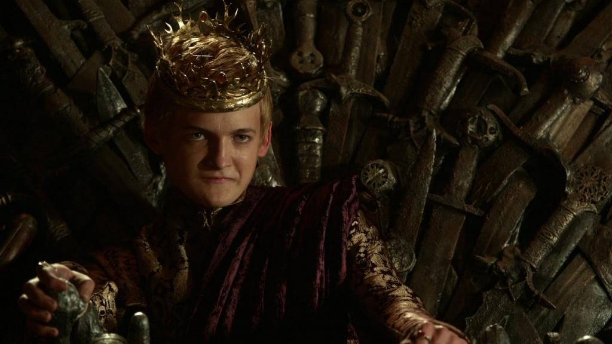
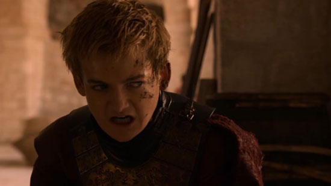

## Isolation

### Context

* Japantown
* Invasion of Ryukyu
* Aid to Korea against manchus.
* Attempted attack on the phillipines in 1637.
* Christian missionaries prompted the isolationist cause. (See [here](./Europeans.md).)

### Christian Persecution

In 1597, 26 Christians are expelled from Nagasaki, and the Shogunate bans the religion in 1612. From 1614-22, hundreds of Christians are executed in Kyoto and Nagasaki and 148 are expelled from Japan.

Meanwhile, a Sendai *daimyo* with ample resources decided to send another independent mission to Europe, in defiance of the shogunate. His samurai, Hasekura, visits New Spain, the Phillipines and Europe, visiting Phillip III anf Pope Paul V. He learns that trade is impossible unless these laws are lifted. By the time Hasekura returns, Christianity is banned, and the Sendai *daimuo*, Hase Masamune, has done something similar. Nothing happens.

## Iemitsu

In 1623, Hidetsugu, the second *shogun* is succeeded by his son. This guy is a somewhat violent character. At 16, he killed his 21 year old lover with a crossbow...

But, like our favorite king, his ass is saved by his grandfather. Prompted by Iemitsu's nurse, Kasuga Subone, who travelled to Ieyasu personally to have him intervene directly. Iemitsu keeps up the paralells to a certain bastard with his massive religious crackdowns on Christianity. When the Portugese object, he kicks them out.

### *Sankin Koutai*

*Daimyo* are told that they need to spend every other year in Edo waiting on the shogun. They need to maintain 3 mansions, 1 for themselves, one for their son, and one for their wives as *permanant hosatages*. Plus, the *daimyo* have to pay travel expenses for ludicrously large maintainer bands, required by law,, which puts an enormous strain on their wallets.

Iemitsu also visits Kyoto personally to scare the shit out of everybody and give a lecture that the "shogun will do as he likes".

## 鎖国

With England pulled out, and the Portugese kicked out, the Dutch are left, on the strict condition that they do not spread Christianity and not leave Dejima. How damnedably Asiatic...

This begins the *sakoku* period. Trade also continues through Tsushima with the Koreans, and Chinese vessels regularly visit, as well as ships from Cambodia. There's also a Japanese embassy in Pusan. Trade also blossoms with the Ainu of Hokkaido. Since wet rice couldn't be grown there, the economy is fundamentally different, and trade between the Northerners and the Japanese grows through Matsumae Castle, Japan's own Winterfell.

Yep, we;ve got stabbing, hacking, incest, rape, sucicide and absurdly complicated power politics, plus an asshole ruler and struggles with barbarians in the frozen North. I'm on to you, George RR Martin...
