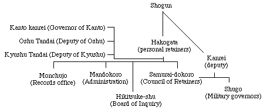

# Minamoto Yoritomo and the First Shogunate

## What did we miss?

Basically, the Genpei war, which was a massive war between the Taira and the Fujiwara. Check Wikipedia. Anyhow, we end up with the Minamoto seizing power from the Fujiwara and establishing military domination of the whole country. In 1185, the Minamoto finally overthrow the Taira, and 8 years later, Yoritomo becomes Shogun. The Kenmu restoration won't topple this shogunate until 1333. In this time, Kamakura becomes the second largest city in Japan.

## The First Shogunate

*Shogun* is short for *Saiidaishogun*, a great barbarian subduing general. The Japanese call this government a "tent government", ruled from the battlefield, rather than Heian.

### Kamakura

The shogunate moves to Kamakura, sets up shop around the Hachiman war shrine and officially renames Heian 京都 to distinguish it from the real locus of power.

#### Zen Buddhism

Kamakura becomes a center of culture based around a new school of Buddhism, the Zen school. We also see the construction of the 大仏 of Kamakura. The temple surrounding it was destroyed in a tsunami, leaving the great Buddha out in the open. Kamakura becomes a center of Zen and Zen temples.

#### Sculpture

Kamakura sculpture was extremley detailed and realistic. I don't have time, we're 3 slides ahead.

### New Offices

Instead of cooperating with tradition, Yoritomo sets up the *shugo*, military governors of prefectures gifted to them, which begins Japan's feudal tradition. At the same time, the Emperor appoints absentee governors of provinces. Yoritomo doesn't displace these guys at all. He simply adds his own governors with certain *extra* responsibilities. He also appoints bailiffs from the his samurai, who recive a payment for keeping order in a certain prefecture. This is a key feature of Japanese feudalism. Ownership doesn't matter as much as tax collection priveleges do. The *shogun* also appoints deputies who spread throughout the country.

### Yoritomo's Death & Its Aftermath

Yoritomo is bucked from a horse at 5 after inagurating a bridge, which, in a country known for interesting and exciting ways to die, is a really depressing way to go. Seriously, really? A horse? He was buried in a small unmarked grave, where he remains to this day. He was survived by Tokimasa, his father, and his daughter Masato. He is succeeded by his son, Yoriie. Yoriie is deposed by his younger brother Sanetomo, and that's the end of the Minamoto line.

## The Houjou Regency

Following the death of Yoritomo, *another* regency is established. The first regent is Houjou Tokimasa. His children Masako and co. are afraid that he's going to seize power for his *new* wife, so the arrest him and shiphim off to Hokkaido where he can't cause any more trouble. Nice kids. Yoriie is deposed for the exact same reason, with the additional charge of wanton behavior and drunkenness, so his mother packs him up and sends him to Hokkaido, too. This results in Sanetomo, Yoritomo's younger son. An inoffensive person, he has a good relaionship with the Imperial family, but this is short lived, as Yoriie's son, a priest names Kugyou and Sanetomo's nephew, assassinates him for revenge. The tree where this assasination happened still stands. Sanetomo walked under the tree after a Buddhist service and was killed by a not-very-stealthy ninja.

### Masako, the "Nun Shogun"

Most of the event of this time are masterminded by this woman. After Yoriie's unfortunate "accidental" death in exile, she tries to legitimaze the regime by going to 京都 and finding an Imperial family member to serve as *shogun*. The Imperial family, not realizing what the hell is happening in their own country, say no and pass up the oppurtunity to lead Japan as military rulers. The Fujiwara regent is chosen instead, and the Imperial family later grabs the Shogunate, but by this time, the Houjou regency is controlling everything. Poor Imperial family. She co-rules with her father Tokimasa and her brother Yoshitoko. She deposes Tokimasa in 1205 and co-rules with Yoshitoki. When the Joukyuu War breaks out and an emperor rebels against the shogunate, Masako exiles him to Iki island in the Tsushima strait. The Shogunate then installs offices in Kyoto.

### The *Goseibai Shikimoku*

This law code was laid down in response to a growing number of court cases and was the first law code since the *Ritsu-Ryo* code, which adds provisions relating to the samurai and military gvernment.

## Power Structure

SO:

We have a reiging empror, 2 or 3 abdicated emperors controlling him, the Fujiwara Regency controlling him, the Shogun controlling them, the Houjou regency controlling them and in time, there will be another regent controlling the Houjou guy. In Japan, once a position is created, it's never removed, which means that everyone down the line acts as a kind of contributor to a government consensus.

The descendants of Tokimasa continue to act as Houjou regents and guide Japan into a stage of economic growth and population growth as the country becomes more productive and a warrior culture emerges. This lasts until...

## The Mongols

The Mongols at this time have swept pretty much the whole Asian continent. Kublai Khan sends a letter to the Emperor asking him to swear fealty, and the Emperor says "no". At this time, the Houjou regents knew about the Mongols from Zen priests, and wasn't exactly in the dark. Coming up! The Mongolians invade in 1274! I think we all know how that ends...
