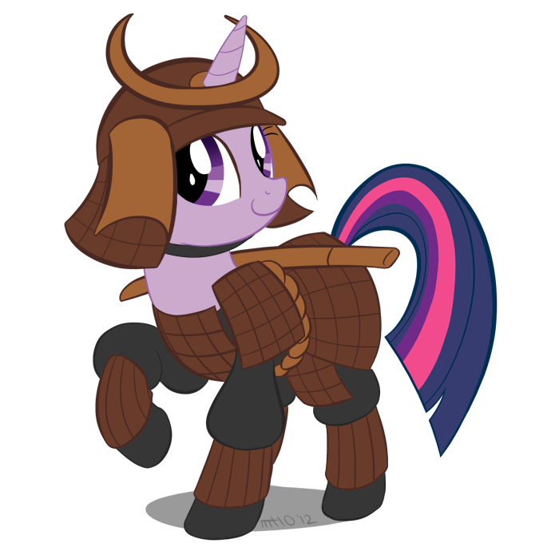

# Final Lecture

Since this is the last lecture, I'll just write it straight.

水戸学 was a school of thought popular in Japan at the time, which combined Kokugaku with COnfucianism and Western science. It promotes the Inperial cult, produces alternatives to official histories, and encourages the expulsion of FOreigners. Major daimyo from Satsuma, Choushu and Mito don't like the idea.

Townsend Harris was praised by Congress for understanding the Asian mind well, and proceeded to destroy that perception by angrily demanding lots of courtesans from the Japanese. Behavior aside, he argued that Japan should sign a treaty guaranteeing free trade. The Japanese protest, claiming that this would cause an outflow of gold, but the US threatened Japan by asking them to look at China. Japan eventually takes a gamble and signs a treaty, opening Kanagawa, Hyogo, Nagasaki and Niigata. Americans are allowed to reside in Edo and Osaka as well. The Japanese are furious when they find out that they can only charge about half the tariffs the US did, but they won a major victory in keeping opium out. In exchange for not having their country ravaged by opium, Japan makes some more concessions:

* US citizens can't be tried in Japanese courts. THey must be tried in the US.
* US firms have the right to sell warships and US crewmen to Japan. While Japan doesn't have to buy them, it does.

The current Emperor, Koumei, doesn't like the treaty one bit, calling it a "blemish on our empire and a stain on our divine land".

The Japanese diplomat in charge of treaty negotiations, a man named Hotta, is replaced by Ii Naosuke. The treaty then goes into effect. Gold flows out, silver devalues, purchasing power plummets, domestic products flow out. People are extremley angry, but beer flows into Japan at an enormous rate, making it Japan's most popular beverage to date. (Beer and edamame is amazing.) Russia, Britain and France all pile onto Japan, making her economic problems worse. At the same time, there's a succession crisis, and a very conservative emperor ends up on the throne, popularizing the *sonnou-joui* movement, with pressure to expel the Westerners.

In 1856, Naosuke leads what's known as the Ansei purge, as hundreds of his rivals commit seppuku. With no more rivals, Naosuke is free to open ports more, and pissed off junior samurai begin conducting terrorist attacks on foreigners. Matters come to a head, and angry samurai and ninja assassinate Naosuke. The Shogunate responds by trying to make amends with the nationalists and Imperial court, and abolishing *sankin koutai*. This abruptly halves the population of Edo. Emperor Koumei's sister also marries the Shogun Iemochi. As daimyo evacuate Edo en masse, 20 or so Satsuma samurai come across Charles Richardson, a British tourist. Furious that he doesn't bow, these samura hack him to pieces. The Shogunate tells the British to talk to Satsuma instead, and the Emperor issues an order to expel all barbarians, which isn't followed at all. Choushu daimyo in Satsuma start firing on Western ships, the Shogunate condemns it, and the British bomb the crap out of the Choushu city of Kagoshima in retaliation for both the shooting and the earlier death.

One year leter, in 1864, the Choushu attempt to sieze the gate of the Imperial Palace and take the emperor under their custody. The Shogunate thwarts this with a network of secret agents and hired ninja. Later that year, the Shogunate invades Choushu and defeats it with Satsuman forces. It doesn't take long for loyalists to rise up in Choushu again. The Shogunate sends a navy this time and bombs the crap out of Kagoshima again. Yoshinobu then becomes shogun, and starts getting friendly with France. Knowing how much England hates France, Choushu secretly allies with England. Later Satsuma. Later Tosa. Later Hizen. Then Nagasaki. They quietly bide their time.

In the midst of this Choushan revolt, the Shogun receves a letter from Tosa, besically telling him to step down and leave Japan with one leader in these troubled times. Yoshinobu panicks, realizing the massive amount of firepower these southern territories have, and steps down, abolishing the Shogunate after centuries of rule. But he still imagines himself as head of some sort of new group of daimyo. Imperial samurai don't like this, and war breaks out accross Japan. The massive Choushu allaianace and the British fly the Imperial standard, demoralizing samurai fighting against them so much they often commit seppuku right on the battlefield. (Because, you know, WHY ARE YOU EVEN SURPRISED?) This period of fighting is called the Boushin War, which you've probably heard of. (*Ran* was set during it).

In April of 1868, the new leadership, in the name of the new emperor, swear fealty to the young emperor. His name, of course, is Meiji. They  issue the Charter Oath, which:

* Convenes representative assembly and government
* Opens government to all social classes
* Abolishes frozen vocations and the class system
* Opens Japan to the West

So that's it! That's Japan, all the way from Izanami and Izanagi's bizzare screwing all the way up through the millenia. It's been an honor to experience all the history, and of course, Every. Last. Suicide.

Peace out!

