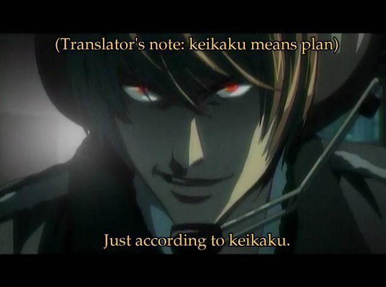
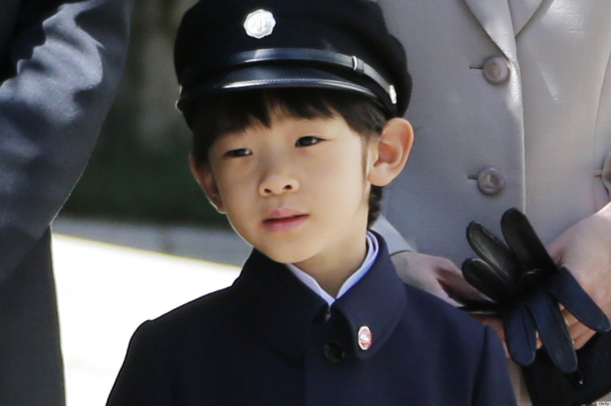

# The 1980's and '90s.

## Pop Culture

In the 1980's, Japanese culture takes over the world.

* Robots
* Manga
* Anime
* Pokemon
* Mecha
* Video Games
* JPop (And Enka, too)
* Cosplay
* Sushi and California Rolls
* Instant Ramen

Having a lecture in this is really awkward, actually.

## The Decline of the LDP

In the late '80s, the LDP had been mired in so much scandal that they were bleeding votes right and left. If you'll remember, Noboru, from that lecture you did n't write down, who got caught in huge scandals with the Recruit corporation, increased military ties with us and issued a "consumption tax". He was succeeded by Uno Sosuke, who fell from power when a geisha went public and complained about his abuse. He was replaced by Kaifu Toshiki, who was succeeded by Miyazawa Kiichi. Meanwhile, the Japan Socialist party changes its name to the Social Democratic Party, and elects Doi Takako, its first female chair. This brings in more female activism, and the party recieves gains in the Diet. When Tienanmen happens in 1989, their closeness to the CCP was cause for alarm, though, and their rise slows. While we ban all arms sales and talks with China and impose sanctions, Japan temporarily suspends economic aid. We tell Tokyo that this is insensitive. Japan later tells Beijing that they don't agree with the G7 statement they signed. China remains Japan's #1 trading partner. In responnse to the splintering of the LDP, remaining leaders join with the SDP in a coalition, which puts LDP people in the cabinet and destroys the SDP's reputation.

## The First Gulf War

After supporting Saddam in the Iran-Iraq war, we conclude Saddam's massive army is dangerous, especially as Kuwait refuses to renegotiate Iraq's massive war debt and illegally drills for Iraqi oil. Saddam asks us if we give a shit about Kuwait, and we say no, then acts surprised when we smack the shit out of him. (My professor has strong opinions about this.) Japan, which imports huge amounts of oil from Iraq and has antiwar sentiment, refuses to join the coalition, claiming that "countries with oil, in our experience, want to sell it". Congress threatens to withdraw troops from Japan. The Jietai says "go ahead". Japan solves the crisis by giving us money instead.

To make sure that this conflict doesn't happenagain, the Jietai is authorized to o abroad for peackeeping operations only.

## The Miyazawa Bush Summit

Following the sudden collapse of the USSR, Japan quickly moves to prevent a cold war between the world's 2 largest economies. Bush Sr. brings the top 3 auto CEO's to Tokyo to speak about the need to equalize trade. This pisses the Japanese off, and Japan's newspapers basically treat us like shit. This is made worse when Bush vomits in the PM's lap at a state dinner. This being Japan, it's the most hilarious thing ever, and they replay it. A lot. In fact, it's still used as a gag clip today. It takes an Imperial wedding to distract everybody, which triggers a succession crisis that's solved by the birth of Hisahito.

...That kid is adorable. Seriously, the Imperial family has some good genes.
