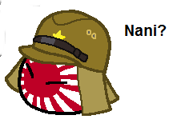
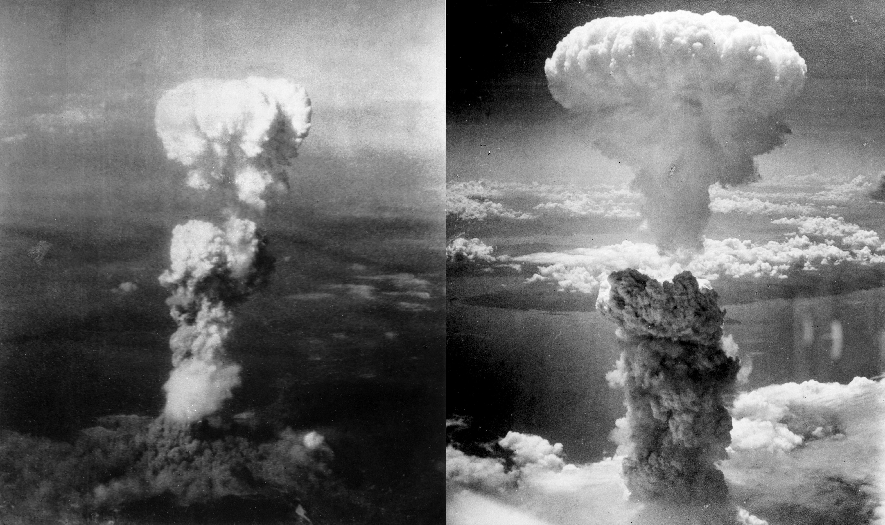

# The Defeat of Japan

## What did we miss on Friday?

Japan accidentally all of Asia. Fortunatley, you know a lot about WW2 history, so please, for the love of God, review your military history before the final.

## Peace Talks and Nukes

In 1945, the writing was on the wall, and Japan knew she was screwed. Japanese diplomats try to hammer out peace agreements more favorable than what they knew they were going to get from us in both Switzerland and the USSR. Central to debate was the notion of the Emperor
's divinity. The Japanese demand that this position remain. Douglas MacArthur says that this will be decided by the sovreignity of the Japanese people. And as a result, peace talks stall. During the Potsdam Conference following the defeat of the Nazis, basic issues related to Japan were hammered out. Japan would be allowed to continue as a complete nation on the condition that it gave up all its colonies and unconditionally surrendered. At this time, Eisenhower announces the success of the Trinity test, and the willingness of the US to nuke Japan to prevent a Soviet invasion of the Home Islands and end the war with minimal loss of life. Japan calls our bluff.

Big mistake.

This class assumes the 4 reasons Mark Selden cites for dropping the bomb.

* Wartime goals called for unconditional surrender
* Racist assumptions and conviction that atrocities nullified humanitarian concerns
* The idea that nukes would shorten the war and save American lives (An invasion of Japan was predicted at 200,000 casualties)
* The commitment to contain Communism and the USSR

Shortly after the bombing, the Air Force asks the Manhattan Project leaders how many nukes would be needed to make nuclear war against the USSR effective, showing that the USAF wastes no time.

## Russian Invasions

The Russians finally declare war on Japan, seizing Sakhalin and the Kurils. Tokyo and Moscow continue to claim the territories, and the argument is made harder by the lack of a formal peace treaty ever being signed between Russia and Japan. (Japan did cede the islands to Russia in Tokyo Bay, but the Russians never signed the treaty.) To this day, the return of the Northern Territories is a favorite cause of the Japanese right wing. Plus a lot of them raise swastikas in Tokyo, which makes things awkward for Abe now...

As the Soviets advance into Korea, Stalin advocates for an independent Korea as soon as possible, which the USSR will not manipulate at all. Once they hit the 38th parallel, they call us and ask us if they should march to Seoul. We tell them to stop. Japan fears a future with North Japan and South Japan and fears a full annexation of part of the Home Islands. Seeing occupation by us as the lesser of multiple evils, an Imperial conference is called in August 7th, anf Hirohito agrees to surrender on the condition that Japan survives. The next day, the USSR declares war, and Japan panics, surrendering as soon as possible. This is the first time that most Japanese hear their Emperor speak. He claims that "the war situation has developed not necessarily to Japan's advantage."

Japanese understatement at its finest. He makes no mention of the USSR, but mentions the nuke, demanding that the Japanese suffer the unsufferable and accept occupation. The Prime Minister resigns and is succeeded by Higashikuni Naruhiko, who remains under US occupation. Police in Tokyo are ordered to arrange brothels for arriving US troops. Townsend Harris would be so proud. And women apply by the thousands, neccessitating the creation of the Recreation and Amusement Association, that exists to this day, where experienced prostitutes taught new recruits the tricks of the trade, as well as strategies to deal with the feared wave of US rapes. When we arrive, this system is super-effective, with each woman serving over 60 soldiers a day.

## US Occupation

In the aftermath of the war, we only lost 112,000 people in the Pacific War, compared to Japan's 1.1 million. (We still use the Purple Hearts created for an invasion of Japan.) We then show up and set up a new regime. There's techincally something called the Allied Council for Japan, but true power is wielded by Doug MacArthur. MacArthur is actively interested in dissolving the British Empire as well, plus China falls back into civil war and we fall out with the USSR, so it's the US running the show for 6 years. There are 2 stated directives of our occupation of Japan, demilitarization and democratization. The first is quickly accomplished, as all troops are demobilized and brought back home. All military installations are taken over by us or blown to smithereens. By 1948, anyone who objected to the occupation was purged. This seems harsh, but compare our .3% in Japan to our 13% in Germany. We saw Japan as a nation with less of a democratic tradition, as well, which led us to be a bit lighter. Punishment is percieved as arbitrary, but the Emperor is spared punishment and the Diet contnues to function under supervision. All Japanese citizens not living in the Home Islands are brought home and Koreans and CHinese are sent back. Of the roughly 2,800 Japanese children abandoned in China, almost all have resettled in Japan following the normalization (well, "normalization") of relations between Japan and the PRC. However, they face a lot of discrimination because they act like mainlanders.

Within the first month of the occupation, Hirohito meets with MacArthur, who refuses to order the emperor to come and waits until Hirohito decides to come. MacArthur realizes the value in the position of the Japanese emperor, and the two present an image of total cooperation. Many Communist leaders who were locked up by the Japanese are treated with respect by our soldiers as well, and many Communist rallies are attended by US military leaders who cheer their opposition to war. The Communists see the occupation as a true bourgeois revolution, finally ending feudalism in Japan. Immediatley as we arrive, labor unions form. Within 18 months, 5 million workers unionize in almost 19,000 unions.
