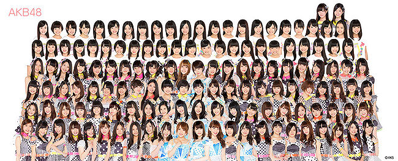

# Early Japanese Fascism

Sorry I'm late, 40's a bitch. You missed the New Women's Assiciation, the Red Wave Society, and the Bluestocking journal, all Japanese feminist pieces/

## モダーンガール and late Japanese Feminism

Japanese flappers! Bobbed hair, fancy hats, freer love, everything we see in the '20s. Swing music is, interestingly enough, never huge, even people who like it call it "grotesque music", and the genre name survives in Japan today. A scholar named Tanizaki Jun'ichiro writes many studies on these girls, includling *Quicksand*, which explores the topic of lesbianism, *Some Prefer Nettles*, about cultural clashes and polygamy, *The Makioka Sisters*, a satirical story about the difficulties of arranged marriage and family life. His last work, published after the war, explores the theme of voyeurism.

### お見合い

This arranged meeting remains popular in Japan today, where people examine photographs and are set up by their parents. They aren't involuntary and are also appreciated, but they can be very awkward, and are a frequent topic of comedy.

### The Takarazuka Revue

Just as *kabuki* is an all-male drama, as is *no*, this early Taisho theatre was designed to only show women. It starts around Osaka (are you even surprised?), and crossdressing is the norm, as in the male type of theatre. Japan goes on to totally not have an obsession with a hundereds of girls singing at once...

Women also begin to get the right to vote! Yay! Now...

## The Beginnings of Japanese Facism

There are tons of types of facism, from Mussolini's corporatism to Hitler's ultra-racism, to Franco's... whatever it is Franco did other than bombing Catalonians. What ties all kinds of fascism together is an open disavowal of democracy. There remains some controversy today over whether Imperial Japan should be considered a fascist state. Certainly you had fascist *movements*, and Japan, being Japan, was militarist, expansionist, and pretty racist, but shouldn't be called facism. Regardless, Japan ticks a lot of the boxes.

* Totalitarianism
* Anti-democracy
* Merger of state and corporate control
* Capitalism serves the state
* Thought/information control (never to the measure of the Nazis, but still, it's there)
* Repressive security apparatus, although there's never a Japanese ***ϟϟ***.
* Ultra-nationalism
* Military expansion
* Racism
* A mass political party
* A charismatic leader

So, do all of these symptoms of fascism apply? There was no Japanese fascist party. All there was was the Imperial Rule Assistance Association, formed from the 2 parties, which only happened in 1940. There's also no charismatic leader. Hirohito never shows up except to ride around on Shirayuki, and people don't even know what his *voice* sounds like until 1945. Plus, Tojo is generally unlikeable.

> "Japan will never survive into a true fascist state unless power is vested into a leader, like a Führer or a Duce." -Adolf Hitler

Of course, Hitler was seen as a hero in a lot of Europe, and England was a fan of Hitler as a bulwark against Communism. Lindbergh was a fan of them, as was the ambassador to England. The Comintern has its own ideas about facism, seeing it as a new, more vicious type of capitalism. Saying, basically vebatim, that "facism is everywhere, man! It's EVERYWHERE!", they call for a "United Front Against War and Fascism".

### Ultranationalist Societies

First and foremost, the Dark Ocean Society, the number 1 example. Like, everyone's heard of this one. This society is founded by angry Fukuoka samurai, dismayed at the failure of Japan to invade Korea. The founder, like Itagaki Taisuke, started by advocating popular rights, but shifted to advocating military action in Korea, forming a spy network and connecting with "Asia for Asians" types (ironically including Sun Yat Sen) and angrily injuring Okuma Shigenobu. As a shady bunch, they partner with both the *zaibatsu* and the *yakuza*. Just a heads up, the *yakuza* are freakin' terriying; even today, many simply operate above Japanese law. Amazing tattoos. Expect Cadillacs, and huge white suits, and a missing fingertip or 2. Like, the most stereotypical gangster imaginable. They're quite popular in their hometowns, too. They operate Japan's prostitution industry, paying taxes to the government for the privelege. They also run *shinto* and *bon odori* festivals, and *pachinko* parlors. We'll talk mre about the *yakuza* later. The Dark Ocean Society ends up evolving into the Black Dragon Society, or the Amur society, named after a river in China. Founded by another Fukuoka samurai, this society travels China trying to subvert European interests. And support Japanese ones, but whatever.
