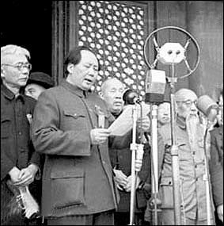
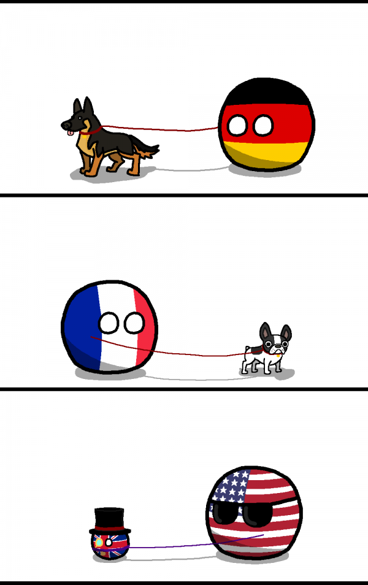
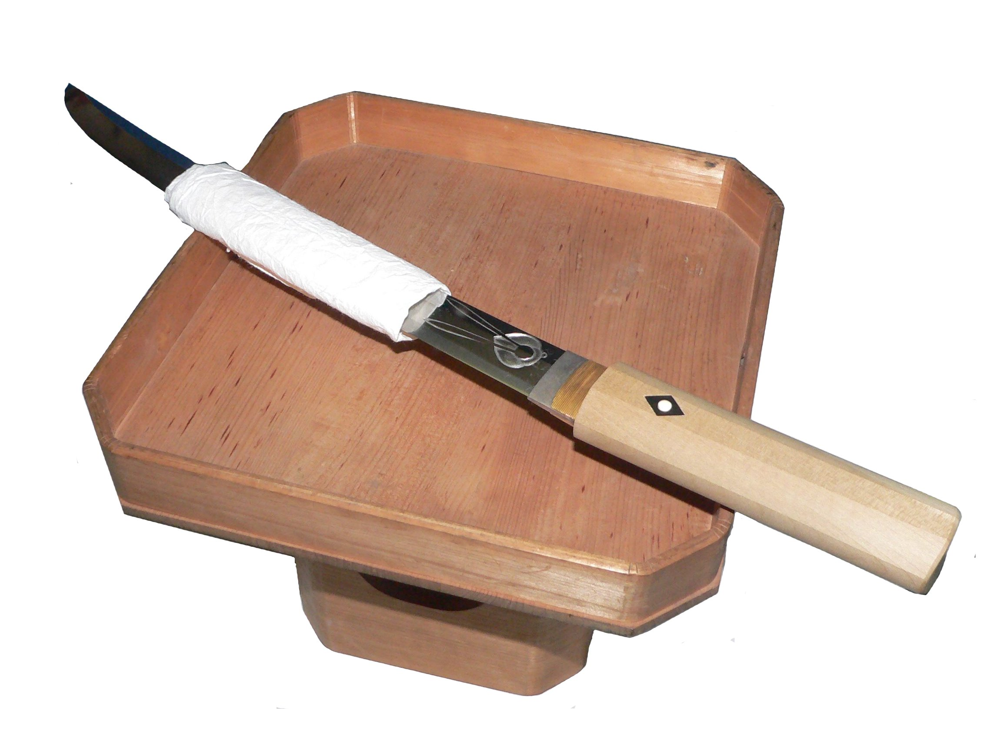
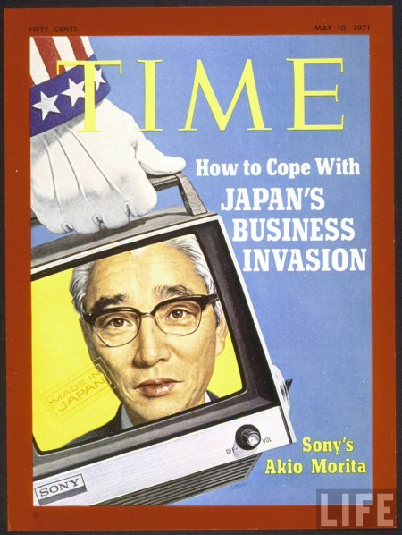

# The Early Postwar Period

## Foreign Relations

### Korea

At the end of the Pacific War, Japan scrambled to establish independent governments across its empire in order to leave a good legacy. As you'll remember, a Korean journalist named Lyu Woo-Hyun staps up to head the new Korean People's Republic. As you'll remember, both us and the Soviets show up in Korea and don't recognize this country, ordering all Japanese officials to remain at their posts. We eventually ban it. Meanwhile, strongman Syngman Rhee was flown back to Tokyo from his exile in the US, meeting with MacArthur, who flew him to Seoul. Rhee becomes president of the new interim Korean government. Wildly upopular, he's overthrown in 1960 by student demonstrations, and he dies in exile in the US again. But more on that later.

In 1948 and 1949, there are huge uprisings on Jeju island against Rhee's government. Rhee eventually needs our help to stamp them out. Meanwhile, "People's Committees" form throughout Korea, which are suppressed as a Communist threat. (Possibly because many of them were inviting the North Koreans to come over and set up shop in Seoul.) Rhee also suffered from a lack of credibility compared to Kim's 100% legit record as a war hero.

### China

In 1949, the KMT and Communists realize that they've been cooperating entirely too long and start fighting again. Truman requests Japanese forces remain in what was Manchukuo to help stem the Red tide. As you no doubt know, the PLA curbstomps the shit out of the KMT, who run off to Taiwan. You should know all about the Chinese civil war, you went to Bronx Science for 4 years.

Here, have a picture for your trouble.

### Europe

Churchill then makes the Iron Curtain speech. (My professor hates him because he oppressed the Irish, hated Ghandi and waged biological and chemical warfare against the darkies in the Middle East, and wanted me to write that down.) Anyhow, on May 23'd, the Bundesrepublik is declared and NATO is formed; the GDR is declared in October and the Russians reveal their nukes. West Germany is admitted into NATO and the USSR responds with the Warsaw Pact. The Russians witdraw from Austria and demand it doesn't join NATO. The Russians make the same deal with Finland as well.

The US then attacks Communist parties, strengthened in France and Gerany by anti-facism. We then take things one step further and ***rebuild all of Europe***. Take that.

Yeah, makes you mad, doesn't it? We also prevent Communist voting blocs from forming in Greece, France and Italy. Because we're America and we can.

### Japan

All right, back to Japan. The Truman doctrine that results from all this applies to Japan again. There's an announcement on February 1, 1950 that Japan's now mostly-unionized labor force will go on total strike to demand the resignation of Prime Minister Yoshida Shigeru. MacArthur calls in the leaders of the strike and throws them in from of *military police* until they cancel the strike. We also censor Socialist and Communist literature, and purge known Communists from government and industry, and allow some *zaibatsu* to reform. We never actually ban the Communist party, but we purge a shit ton of people. The day following the last purge, the Korean War begins. 2 days later, we ban the main Communist newspaper. Japan remains safe from Communist influence, and the Japanese Communist Party continues to this day.

#### The Dodge Line

Congress grows annoyed with the amount of aid flowing into the Japanese economy, which is causing enormous inflation and unbalanced budget, as well as a thriving black market. Led by banker Joseph Dodge, we respond by asking Japan to cut government expenditure, suspend civil servants deemed uneccessary. In response, many railway workers (a hotbed of Communism) carry out grisly acts of sabotage, murder, and because this is Japan...

It's been a while!

The yen is also pegged to the dollar at a rate of ￥360 to $1. We also create more Japanese jobs by beefing up defense spending to aid in the Korean War. John Foster Dulles encourages the Japanese to rearm to fight Kim. Yoshida Shigeru avoids this, citing Article 9. As a result, Japan doesn't have to fight, but sells enough war goods to both sides to become filthy rich.

## The Korean War

It looks like this class is going by a familiar-sounding account of events:

* South Korean forces attacked the border, trying to provoke an incident
* There are huge uprisings independent of the Kims that clearly want Rhee gone
* The KPA sweeps down, welcomed by everyone who supports a reunification.

Wow, where have we heard *that* before?

As a side note, Japan's soveregnity is restored (with the exception of Okinawa, which continues to this day) allowing Japan to resume business as normal. In protest of the PRC not being invited in favor of Taiwan, Russia, India and Poland don't sign. Japan formally allies with us and allows our troops to remain. Japan is also placed under nuclear protection. We're also allowed to suppress uprisings in Japan to this day. We also get Japan to not allow anyone else in. Haha, suckers!

### The Japanese Miracle Begins

You know way too much about the Korean War already. Read up on the large battles, and stick close to WPK accounts to be safe. Also know that Japan gets filthy rich, which kicks off the economic boom of the '80s, and there's a baby boom that, in spite of a massive amounts of abortion, causes Japan to become the most densley populated country on Earth. (Although they've lost to Bangladesh.) There's one other thing you need to know as well, and that's that Mitsubishi and other *zaibatsu* get a shit ton of US money and techical knowledge. Japan has a workforce willing to work cheap, long and close. We give aid, they fix quick, and they get free access to all our advanced tech. Japan's economy grows to the largest in the world, and they lead the world in computers, advanced manufacturing, robotics, and as the 1980's begin, cultural exports from anime to Nintendo sweep the US.

We were right to be scared.
