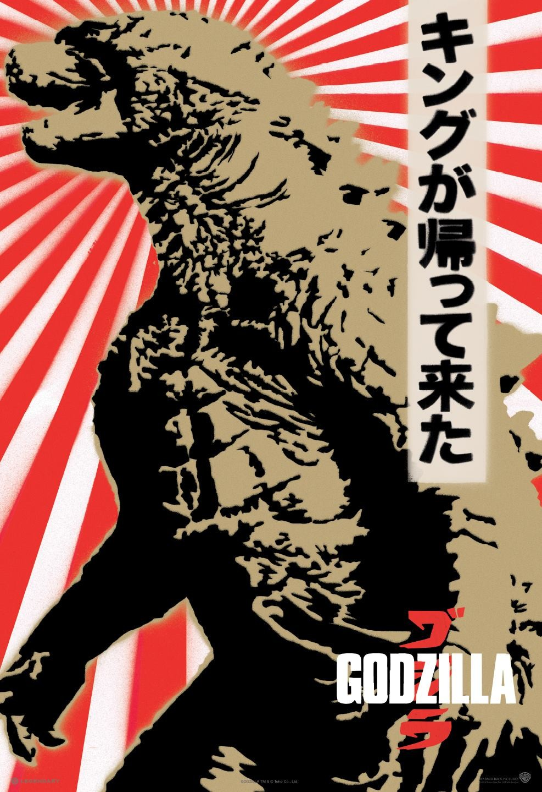

# Rename

***WAKE UP EARLIER, YOU LAZY PIECE OF SHIT.***

Sorry.

## The US Screws With Japan

Apparently you missed an anti US base demonstration, which successfuly limited US presence to 8 bases. That doesn't stop us from putting 80,000 troops in Japan last hear. Ha, suckers!

Anyway, more on how the US is screwing up Japan. We detonate an H-bomb 125 miles from a Japanese fishing ship irradiating hundreds of tons of fish and 23 Japanese. We pay $2 million in compensation, but this adds fuel to the anti-nuclear movement, which culminates with:

***IT'S [GODZILLA](www.youtube.com/watch?v=OX2VaVtFYfs)!***

## The LDP and the Economic Miracle

In 1954, Yoshida Shigeru resigns in a scandal, having refused to look into corruption scandals involving his party and a shipbuilding *zaibatsu*. His resignation ends an era of Japan's occupation policies. In 1955, the Liberal Party and Democratic Parties merge, forming the LDP, which has dominated Japanese politics today. They're rougly analagous to the Tories or moderate GOP. It's so large, it has sub-factions, and much like in feudal Japan, power over these faction is often transferred by marriage. From 1935 to 1947, during the war, socialism grows in Japan, neccesitating the creation of the LDP as a unified voting bloc.

Now, look at this list and see if you can guess what we're talking about today!

* Sony
* Canon
* Konica
* Mitsubishi
* Toyota
* Panasonic
* Nikon
* Nintendo

That's right, it's time for the Economic Miracle! It begins with Sony's transistor radio. (Thanks, Bell Labs) The Canon's Leica is voted the world's best camera. We think a lot of automobiles, but until 1966, most production was of trucks. (MITI doublted Japan could compete with us in cars.) The car boom comes in the '80s. Against this climate of growing economic power, Prime Minister Kishi Nobusuke (Abe's grandfather) resigns over the extension of the ANPO treaty, sparking a wave of protests from workers, students, executives and politicians. The decision is rammed through on May 20 to meet the deadline. In the ensuing riots, a student named Kanbo Michiko is crushed.

## Foreign Relations

What had been percieved as a unified Communist bloc is quickly fracturing in 1960. Khrushchev condemns Stalin and moves production towards a profit-oriented system. Mao argues that Khrushchev is restoring capitalism in the USSR. Miyamoto Kenji, the head of the Japanese Communist Party, tries to capitalize on this, scaling back militant tactics and implementing something called "smiling Communism" and posturing his party as a people-friendly, business friendly transition. He also attempts to straddle the middle of the Sino-Soviet divide. After trying to assert influence in China, he fails and goes home in shamem leading to strained relationship between the CCP and the JCP. (Japan later condemns the USSR's invasion of Czechoslovakia.) As a result of this, the Japan *Socialist* Party cozies up to Mao and Kim Il-Sung rather than the JCP. The leader of the JSP is then stabbed to death on stage by a right wing high school student. Following this, another high school student goes to the home of a magazine publisher who had published a story about Akihito being killed, and stabs his wife.

In 1964, Japan hosts the Olympics, winning out over Detroit, Vienna and Brussels. It's telecast internationally for the first time, and was delayed due to summer heat and typhoons. Japan wins the 3rd largest amount of gold medals after us and the Russians, and inagurates the Shinkansen! Early models travel at a leisurely by today's standards 130 mph, about the speed of the Acela.

Let's leave off here.
