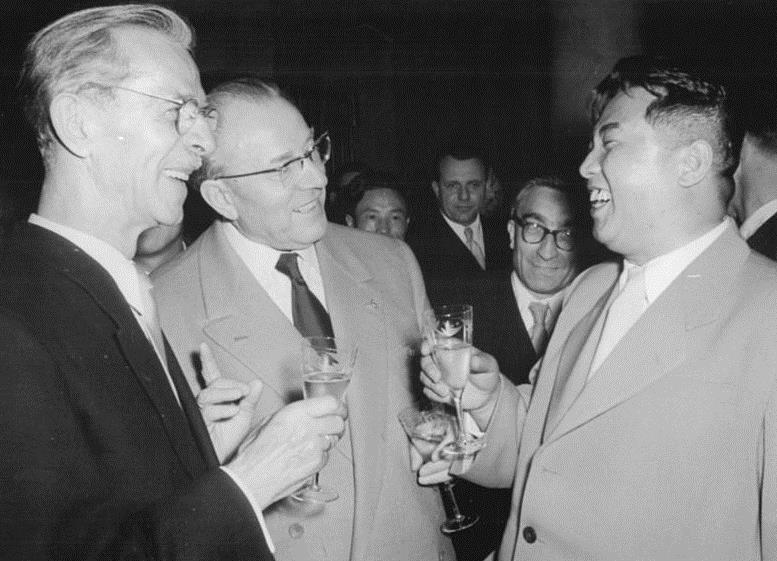

# The US Occupation

## The *Yomiuri* Incident

All right, so let's wrap up our postwar occupation. We left off with the rise of unions, and some of these become quite militant in their pursuit of control of production. This is highlighted in something called the Yomiuri Incident. Since 1868 to now, Japan is addicted to newspapers, and today, Yomiuri cells more than the NYT, WaPo, and WSJ combined, releasing 2 issues a day. In 1924, the Tokyo police officer, Shouriki Matsutarou, takes control of the paper, suppressing Communist viewpoints, but boosting readership to a million by 1938. During the war, it was of course controlled by th military, but in 1945, Yomiuri workers demand Shouriki step down for being an ass with no respect for his workers. SHouriki responds by saying the company is his and that he would "destroy them". With diplomacy off the table, the workers seize control of the offices and publish editorials claiming the newspaper if for the people. Shouriki sends in *yakuza* to bust up the workers, but the Japanese Communist and Socialist Parties flock to the workers' aid. In the end, Shouriki sells most shares and puts a socialist as manager.

## Land Reform

By 1945, there are only half of Japan's agricultural workers left, while the urban population booms. Seeing poor farmers as a gateway to fascism, the Allied Committee for Japan proposes that the Diet enact a land reform law, which is eventually passed in 1946.

* All land belonging to absentee landlords must be sold.
* All resident landowners must sell off all land above 7 acres. (About the size of Tufts)
* No more than a third of your land can be rented out.
* Uncultivated land is purchased by the government and sold off.

This results in the virtual eradication of tenant farming, and to this day, Japan is a nation of small farms. It also explains why growing food in Japan is efficient, but very expensive. This is also the death of the landlord as a father figure to his tenants. A lot of this is the result of cooperation between farmers and the Liberal Democratic Party, which leads to a groundwell of support for the LDP. Also, since the LDP is best friends with us, they can turn down our requests for Japan to import US rice, lest they lose votes and the Communists come to power.

## *Zaibatsu*

In 1945, all *zaibatsu* assets are frozen, and we encourage the Japanese to do some trustbusting. In 1946, the Holding Company Liquidation Committee was established, dissolving them into their independent component companies and dismissing many family members and former officials. In 1947, the Anti-Monopoly act is passed, targeting 325 companies. However, due to alarm from Japanese and US conservatives, only 19 are targeted, which explains why we still have *zaibatsu* today. (Hatsune Miku is owned by Crypton Future Media, owned by Yamaha, part of the Yasuda *zaibatsu*.)

## The Tokyo Trials

11 judges from 11 nations take part. Tojo is hanged, under protest from Churchill. 6 are hanged for crimes against peace, but over 700 for minor offences. The Japanese felt no sympathy for these criminals, but they also felt that no justice seemed to be done. One Class A war criminal, Mishi Nobusuke, the Minister of Mutions, is actually released and allowed to become Prime Minister. And he had a grandson!

Oh, wow, this is awkward. Moving on...

Another intriguing figure is Kodama Yoshio, a right wing spy in China, sentenced as a class A war criminal, but is released in 1948 to help us firght the Communists. Using US, yakuza and LDP positions, he's qute influential in Japan today.

And yet another, Sasakawa Ryouichi, who amassed a fortune through rice speculation, became a Diet member, helped found Japan's air force, flew a fighter jet to protect Mussolini, and made more yakuza connections. Until his death, he was loved in Japan.

## State *Shinto*

What do we do with a religion that revered the Emperor as a living god that the Japanese would die for? The religion is disbanded in 1945, and there are calls by some of us to level all *shinto* shrines. Japan tells us that this is a *really, really* bad idea, so we let folk *shinto* stay, on the condition that the shrines are privatized. Yasukuni, where all the war criminals are enshrined, is basically bought out by the government, so... mission backfire.

On New Year's, 1946, Hirohito says that his isn't a god in human form. However, he doesn't deny that he's a *living god*, which is what the Japanese still believe. Oops. Best 3 of 5? He also says that the Japanese aren't destined to rule the world.

## New Constitution

This new constitution replaces the religion heavy Meiji constitution. There are 3 very important clauses.

* The emperor is a "national symbol", not even the head of state. (Although he still leads the Japanese faith)
* Article 9 renounces the right to wage war. (For now...)
* Article 14 bans sex discrimination, which we expected the Japanese to hate, but they seem to be OK with.

Now Article 9 claims that Japan will never maintain military forces and that belligerency of the state will never be recognized. (Japan has the 4th largest military in the world, but it's totally for self defence, guys. Stop asking questions.)

There is widespread annoyance as to the fact that MacArthur basically wrote the damn constitution himself, because he's a badass. The Japanese don't seem to think so, and only 5,000 rally for the constitution, compared with 400,000 Communists. The Japanese have never amended their constitution, although the LDP continues to push for getting rid of Article 9.

## Education and Police System

Civics texts are removed, "moral education" is ended, (although they've been restored) local school boards were temporarily established before a crackdown in the 80's, and a Western system of 6 years of elementary school, 3 of middle school, and 3 of high school is established. MacArthur calls for "Bibles, Bibles and more Bibles" for the schools as well. The police forces are revamped, and in 1950, a National Police Reserve is established, consisting of 75,000 people. This eventually grows into the Self Defense Force, and as of 2008, the head is permanantly on Japan's cabinet.

## Inception of the Cold War

Of course, at this time, the Cold War starts, Europe is chopped in 2, and Asia becomes a clusterfuck.

### Korea

At the end of World War 2, Japan desperatley tried to find some local authority to devolve rule of Korea to, so they could claim they had granted the country independence. A journalist named Lyu Woon-Hyung accepts the job, as the USSR marches to the 38th paralell. As part of our agreement, the Soviets stop at the 38th parallel. When we arrive in Incheon, we don't recognize this Korean Republic, and order all Japanese officials to remain at their posts. Basically, we intend to occupy it like we did the Home Islands. The Russians quickly withdraws, having devolved power to Kim Il-Sung. We remain in the South to this day. And before you say that's a bad thing, we all know Kim was a Soviet puppet. Here he is in East Germany.

Yeah, that's *Kim Il-Sung*. The family resemblance is actually scary. Like, really scary.
