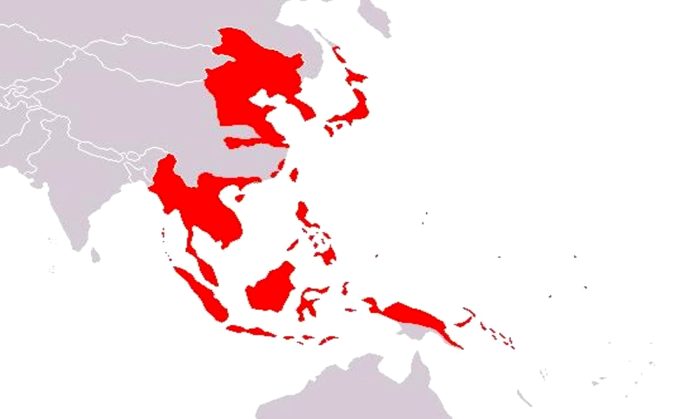

# Rename

OK, so tention is building with the US, but we don't get involved because depression and isolationism. Yeah, we kinda let this happen...

## The Greater East Asian Co-Prosperity Sphere

Yay! Everything's sounding familiar! Anyhow in December 1938, Prime Minister Konoe Fumimaro, an aristocratic Fujiwara descendant, (Note this! He's an aristocrat, not a Meiji oligarch!) proposes a "New Order in East Asia", envisioning an Asia fully under Japanese control. In the 1940's, the military articultes something called a "Japanese Monroe Doctrine". As you may have heard, at Bronx Science, Asia is for Asians! With Japan as their loving ruler, and everyone else as faithful servants... THe term "Co-Prosperity Sphere" is first used in 1940-41. In response, the US freezes trade of oil, scrap iron and financial services. This annoys Japan, because not only do they have no self-sufficiency of iron, but a lot of Japanese money is held in US-banks.

## Nomonan Incident

In 1939, there's a border skirmish between Japanese forces in Manchuko and the Mongolian People's Republic, backed by the USSR. The Japanese have their *asses kicked*, but it's largely hushed up by the Japanese, which is why we're devoting 5 minutes to the "Nomonan Incident", and not 2 lessons on the "Third Russo-Japanese War". 8,000 Russians are killed, along with a whopping 45,000 Japanese. Further angering Japan, the Molotov-Ribbentrop pact is signed a few months later, breaking Japan's agreement with Germany not to deal with the USSR. The USSR claims this is the result of the lack of a united front against Nazism, which means they had to buy time. The US calls bullshit, of course, and Japan proceeds to sign her own non-agression pact in response. Stalin's and Hitler's response basically is "See if we care".

### Polan Can Into Germoney (and Russia)

An aside, but this is obviously when Rosja and Niemcy make divide of Polan and make Polan no longer into country. Kurwa! [If any Poles are reading this, I swear, there's context.](http://reddit.com/r/polandball)

## Tripartite Pact

In 1940, the three countries fast becoming the Axis sign this "military defensive allaiance" in Berlin. Hungary, Romania, Slovakia, Bulgaria and Croatia all hop on, as well. This past includes that the 3 governments agree each nation should have it's own "proper place", and that they'll all stand aside while the others build their "new orders" in other parts of the world. Japan recognizes the leadership of Germany and Italy in Europe and Germany and Italy respect Japan's leadership in Asia. THey agree to establish universal technical standards, which is important, because this means that Japan adopts the German standard for cars, weights, measures, and electricity. They become "good friends in 3 countries", which is th most passively Japanese way I have ever heard to refer to threegroups who want to carve up the whole damn world. Fumimaro is succeeded as Prime Minister by Hideki Tojo, and tensions mount with the US.

## UA-Asia Tensions

Following Poland, France falls, and French Indochina falls under Nazi (well, Vichy) control as well. As a result, the Nazis cede the northern part of it to Japan. The Japanese position forces in Northern Vietnam to guard against the Chinese. This scares the US, which owns the Phillipines, very close to Indochina. In the spring of 1941, the US sends aircraft carriers, troops and war materials to the Phillipines as well as allies in Europe. In 1941, the Japanese occupy all of Indochina. The US secratary of state cuts off all vital trade to Japan, causing Tojo to panic, stating that Japan is willing to withdraw to Northern China and that it would leave the pact with Germany and Italy in return for the restoration of normal trade. It also demanded the US not interfere with this affair in Asia, but please use its clout to convince Chiang Kai-Shek to negotiate with Japan. (Interestingly enough, Japan didn't recognize Chiang anymore, but rather the authority of their puppet Wang Jingwei in Nanking.) Tojo also demands no increase in US military forces in the Far East. Obviously these conditions are pretty harsh, and in 1941, the US says "deal, but you have to withdraw from *all* of China". If Tojo accepted this, his now-militant population would have had a conniption, but if he said no, he would have angered the US. This deadlock is seen by Tokyo as a declaration of war.

## TORA TORA TORA

Japan sees this ultimatum from the US as a declaration of war, and sees herself as encircled, and panics. The question is, do they make nice with the US, or go after the Dutch East Indies as an alternate petroleum source. As of November, the plan went through to grab Dutch oil, and surprise-wipe out the US fleet protecting it. The US knew there were *plans* to attack Pearl Harbor, but no one took them seriously, especially since tey were relayed through Peru.

So, on December 7, 1941, a date that will live in infamy, the Japanese bomb Pearl Harbor, destroying 7 battleships, 120 planes, and killing over 2,000 Americans. And the US is *pissed*, and Roosevelt lets Japan know in one of the most epic congressional addresses ever, declaring war on Japan.

> "I fear all we have done is awaken a sleeping giant and fill him with a terrible resolve." -Admiral Isoroku Yamamoto

There are some people who claimed Roosevelt was itching for war, but regardless, he delivers a speech that everyone needs to listen to. Italy and Germany both declare war on the US.

### BANZAI

The Japanese blitz Asia. That's all we can say about what happens after Pearl Harbor.

* Guam
* Wake Island
* Midway
* Pearl Harbor
* Hong Kong
* Manila & Luzon
* Singapore
* Sumatra & Java
* Burma
* Andaman Islands

All of a sudden, Japan is fucking HUGE.

You'll notice something about this. It's really spread out. And many people in the government panic, seeing Japan as over-extended.

Let's end on a high point for Japan for now.
