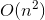
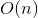

# Sorting

## Unix Stuff

Our CS server now has a mail server! Aren't you guys lucky? Just type `mail -s "subject" example@example.domain`. Easy. (This email will send from agould02@cs.tufts.edu.( If you want to attack something, use `mutt -x -s "subject" example@example.domain`. This also works as a richer email editor.

## Sorts

Sorts are very important, and consist of putting things in some numerical or lexicographic order. A list has to be in nondecreaseing order and be a permutation of the input in order to be sorted. Most sorting was devised in the '50s and '60s. Some sorting can be done in place, other require the allocation of new memory.

In place sorting can be either stable or unstable. A stable sort keeps the keys intact.

We then watched the funny sort video.

### Insertion Sort

This kid of sort can be done in place. Simple enough algorithm:

* Iterate through the list, starting with the second element.
* At each element, shuffle the neighbors below up until the proper place is found for the element.
* Place the element in the new space.

It's kinda shit, but that doesn't mean it's not useful! Worst case performance is . Best performance is , but the average case is still . It is pretty quick for small arrays where allocating memory is a relatively large issue, becaue it has a space complexity of  because we need nothing except one placeholder variable. As a result, this is used to great effect with tiny arrays.

### Selection sort.

This is even easier than insertion sort!

* Find the smallest item in the list
* Exchange it with the leftmost unsorted element
* Repeat

Again, it has an asymptotic complexity of , and will always have this because it always needs to traverse the entire list for every element. This one... it just kinda sucks.

### Heap Sort

We can do this one in place, too!

* Turn the array into a heap. (remember we store a heap as an array, so we just need to move stuff around)
* Iterate over the array and perform `removeMin()`, but instead of returning the minimum element, swap it with the last element and decrement `heapSize`.
* Reheap the new, smaller heap.
* When the iteration is complete, the array will be sorted from low to high priority.

Not as great as some other sorting algorithms, but pretty fast and fairly simple to implement.

### Shell Sort

This one is easy to code, but tough to analyze.

* Rearrange elements so that every *h*th element produces a sorted list.
* Repeat with smaller and smaller gaps.
* When the gap is 1, you're done.

The challenge here is picking a good gap size.

## Homework

* Implement a selection sort.
* Implement either shell, merge, quick or insertion sort.
* Implement a third sort of your choice.
* **Do not implement bubble or heap sort.**
