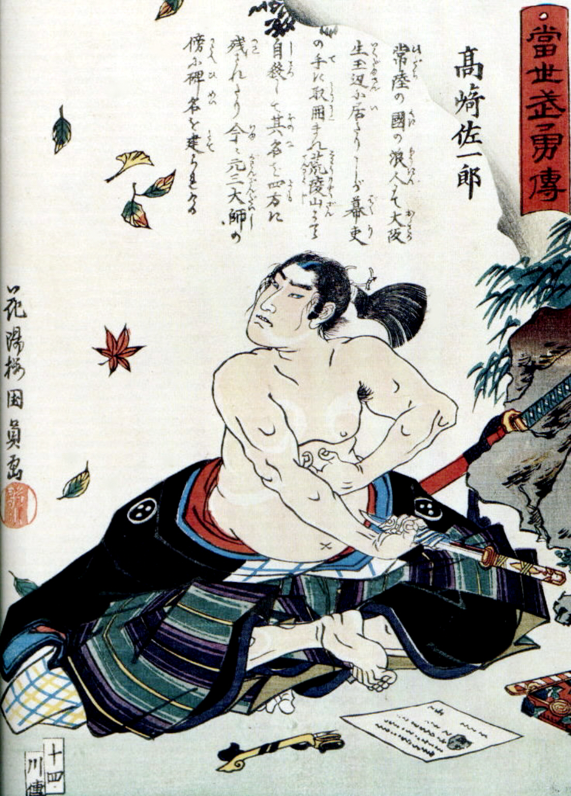

# The Early Tokugawa Period

## Ieyasu's Victories

Ieyasu was born between Oda Nobunaga's domain and that of the Imagawa, in a small area called Migawa Prefecture. When Nobunaga's forces invade in 1584, Ieyasu is sent to the Imagawa as a hostage to secure their alliance. En route, he is abducted by Nobunaga's forces and held in Nagoya. In 1549, his father dies of naatural causes, resulting in war between the Imagawa and the Oda, and Tokugawa joins the Imagawa as a warrior. He later betrays him and joins Oda Nobunaga. In 1575, they whoop the ass of Takeda Katsuyori in the Battle of Nagashino. (See *Kagemusha* for full details) After Nobunaga commits seppuku, Tokugawa gains kontrol ofer Kai and Shinano prefectures, a huge part of the Kanto reigon. In 1584, he sides with a son of Nobunaga and taked on Hideyoshi, but this is diplomaticaly resolved, giving him further control over Edo and its surrounding area.

He stays out of the Korean war of 1592, leaving the job to generals from Western Honshu. When Hideyoshi dies, Tokugawa pulls out of Korea, beginning 2 centuries of peace and cordiality between the 2 countries. Trade and diplomacy flourishes between Korea and Japan, and Tsushima becomes very wealthy from trade.

## The 5-Daimyo Regency and Sekigahara

While Hideyoshi's son is still a child, these 5 lords run the country. Tokugawa, being twice as rich as his next most powerful, dominates the council. The other lords form an alliance, and at the Battle of Sekigahara, Ieyasu destroys his opponnents. (Although he doesn't overpunish.) From this point on, the Sengoku period is over. He establishes control of highways, cities and foreign trade. Osaka is left to the Toyotomi family, which is why Osaka is not like any other city in Japan. Seriously, the place was weird before, but it gets weirder. Ieyasu formalizes his power and becomes *shogun* in 1603. He surrounds himself with clever monks, Zen priests, neo-Confucianists and some European merchants.

## William Adams

This English sailor lived from 1564-1620, and was trained as a skilled mariner, fighting the Spanish Armada in 1588. He's then employed by the Dutch to travel to Japan. He sets out in 1598 and is shipwrecked in Kyushu in 1600. Jesuits in the area were disguted with the Protestant scourge and encourage the Japanese to execute them. The local daimyo says no, and sends the matter to Ieyasu intead. Following a translator mix-up, Ieyasu becomes very interested in Adams' accounts of the wars in Europe. Adams is taken into Tokugawa's service. and lives in Japan for 20 years, given samurai status, a 250 *koku* fief and a mansion in Edo. He marries the daughter of a mid-ranking samurai and has two children who end up renouncing Christianity. In 1613, he writes back to the Dutch, who arrive for trade, much to the annoyance of the Jesuits, who are forbidden by the shogunate from taking action. He also translates Ieyasu's letters to James I, and commends them, calling the "good, couteous, valiant, impracitcal, diverse in opinion", saying that there are no people better governed. In 1613, another Englishman arrives to talk to Adams and discusses trade. Adams is disgusted by their food and doesn't stay for dinner. This other Englishman says that "it is generally though among us that he is a naturalized Japaner". Adams never returns to Europe.

## Japantowns

Communnities of Japanese immigrants set up shop in Vietnam, the Phillipines, Cambodia, Indonesia and Thailand.

## Tokugawa Hidetada

In 1605, Ieyasu steps down and his son assumes power. Following Ieyasu's death in 1616, he marries his daughter to Hideyoshi's son. Remember that Hideyori is heir to Japan proper. After the marraige in 1612, tensions continue to mount. Sekigahara produces huge amounts of *ronin* and samurai are itching to fight. Many simply pledge themselves to the Toyotomi. In 1614, Tokugawa builds perhaps the stupidest CB against Hideyori, claiming that he cast a bell that requires the ringer to smash the Kanji in Ieyasu's name and that that's evidence of a rebellion. Ieyasu attacks Osaka and defeats Hideyori's forces handily. Hideyori's wife is remarried, and guess what Hideyori does?

Are you even surprised anymore?

He was also less friendly to foriegners.

## Ryukyu

In 1609, while Ieyasu is still alive, the domain of Satsuma invades Okinawa, kidnaps the king, and forces the vassilization of Ryukyu, seizing the Amami islands outright. Initially, it had been divided into 3 kingdoms, but had been unified in 1429. Ryukyu pays tribute to Hideyoshi prior to the invasion of Korea, but only half demanded. Ieyasu then repatriates 3 Ryukan sailors, but doesn't get a thank-you notes. The Satsuma use these as diplomatic insult CB's, and invade. Surrender is formalized in 1611, but Ryukyu considers itself part of China. It's only in the 1870's that Okinawa is added to Japan, becoming the first colony of the Japanese Empire. Satsuma demands tax trom Ryukyu to be pain in sugar. Sugar then becomes an enormous part of the Japanese diet.

Ryukyu introduces sweet potatoes to Japan. Oh, and the **samisen**. Seriously, something so central to Japanese culture is introduced this late.
