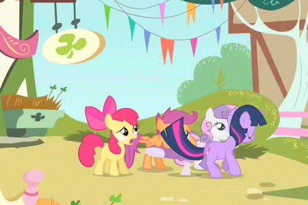

## The End of the Kamakura Period
OK, before we start, guess who just got the GitHub student pack? THIS GUY!

Anyhow, now to pass my CS midyear. But first...

## MONGOLIANS

All right, I did it. that's my one off-color joke.

Regardless, the mongol invasions of 1274 split the Kamukura period in 2. The Kamakura period gives us a flowering of traditional feudal culture and government, but Japan had come under threat from the massive Mongol empire. In 1258, Korea has currendered to the Mongols and 10 years later, Japan gets a recommendation to submit to Kublai Khan and that the Japanese will be "treated well". THis letter goes straight to Kamakura, which overrides the emperor (surprise, surprise), and the *shogun* basically sends the envoys back with nothing. THis really pisses the mongols off, and we get:

### Invasion of 1274

About 23,000 people, mostly Koreans and Chinese in 300 large ships. They were met with some samurai reistance, but then, miraculously a typhoon hits and the Mongolians decide to wait it out in their boats so they don't float away. Most of the sailors drown. After this, Tokimune, the Houjou regent, mobilizes all bailiffs south of Kyoto to prepare for another invasion. In his edict, he basically tells everyone to stop dicking around with small lawsuits and defend their country and nation. This makes Japan one of the earliest nations in the world to develop a strong sense of nationalism and patriotic duty. Whether the consequences of this are a good thing, we'll let historians decide.

### Envoy of 1275

Mongol envoys arrive in Kamakura and demand surrender. In a not-so-subtle-by-Japanese-standards "F**k You", they're beheaded and their heads are sent back to Kublai Khan. He is **pissed**, which prompts the...

### Invasion of 1281

This invasion was *massive*, over 140,000 people in 4,000 ships, the largest maritime invasion ever attempted, 4 times as large as the Spanish Armada, mostly conscripts from the defeated Song army. Phew, long sentence. This is much nastier than the first one, whith close fighting for 3 months. Through the use of defensive walls, dedicated *samurai*, and lots of gunpowder and cannons, the Japanese hold their line. And, once again, there's a typhoon. And once again the Mongols hide in their ships. And, well, you know the rest. Interestingly enough, many boats seemed to be designed for river usage, and a lot of them had masts that were intentionally defective which we can guess might be either sabotage from Song shipwrights.

### Impact of the Invasions

Defenses are maintained for a generation, but that's less important than the cultural pride that Japan gets. Not only is it special, but it enjoys the protection of the gods. Japan is considered the only country to repel the Mongols (unfortunatley, the Mamluks and Srivajaya get short shrift). The concept of the *kamikaze*, a divine wind sent by the gods, develops, and Tokimune is lionized in the *Nihon Gaishi*:

> The corpses so covered the sea that one could walk upon it.

What else is important about the *kamikaze* is that there's a revival of *Shinto*, and the idea of an unbroken line of divine emperors becomes very powerful.

There's also no history published of the event. There are no winners and losers and the war was fought largely by samurai, so there's no need to quantify wins and losses. (The samurai are pretty annoyed that they get no land) A scroll is published, of course, but it's not a super-accurate record, despite being gorgeous, and perhaps the world's first *manga*. The story of the scroll isn't what you'd expect, though. It was commissioned by a samurai to demand compensation for his servoce. Nonetheless, it's a fascinating scroll.

## The Decline of the Houjou Regents

The Houjou decline for a lot of reasons:

* Inability to compensate *samurai*
* Charges of nepotism and office-stacking
* Massive *samurai* debt - all these goods are expensive!
  * There are "virtuous government" edicts that force the bourgeoise to forgive the samurai on their own dime.
* The last Houjou regent, Tatatoki, was really weird, even by Japanese standards of the time:
  * He was absolutley obsessed with dogs
    * He bejewls them and holds them in finery
    * Most heinously, he forces Kamakura nobility to watch and play with them for hours at a stretch. He's hated for this, proving that no matter when or where you live, NOBODY cares about your stupid pets.
  * He was supremley incompetent
  * He had disgusting table manners
  * He was "unashamed before the scorn of others"
  * He dishonored his family
  * As a result, he was deposed in 1333

## Kamakura Culture

Throughout this period, there's ongoing ties with China, including 3 schools of Buddhism:

* Zen - Constant insight and meditation are all that matters. Also, discipline is important.
* Amidism - There's a paradise you can go to if you're righteous.
* Nichiren - Japan can only be saved by the Lotus Sutra. Not observing it will screw you over.

Nichiren was actually almost executed, which he claims was stopped by a miracle, but we do know that he actually was pardones and sent to Sado Island instead. His followers gained a lot of support after the invasion, and he was pardones for predicting it.

### Zen

Zen was founded by a monk called Eisai after studying in China. The *Rinzai* school of Zen focuses on *koans*, sayings that are supposed to make you think and question. The *Soto* school focuses on longer term meditation. Zen was very important to Kamakura tradition. Also, and probably most importantly, Zen Buddhists brought *tea* to Japan. Think about Japan today. THink about that 4 hour tea ceremony you sat through. This is insanely important.
