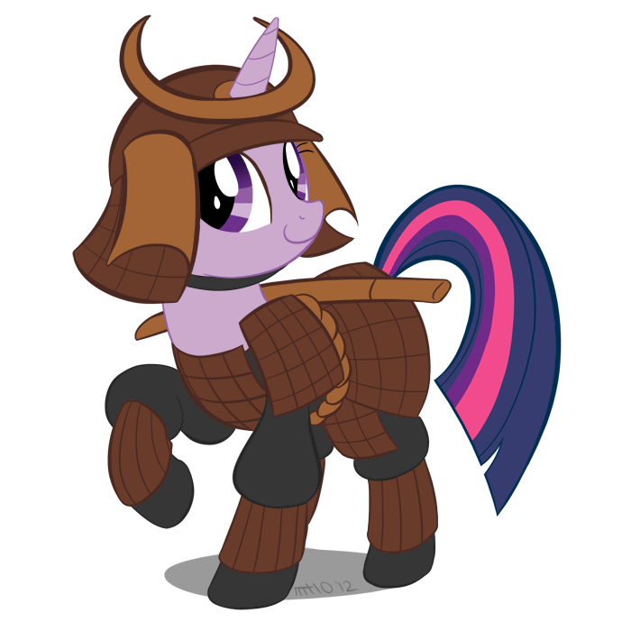
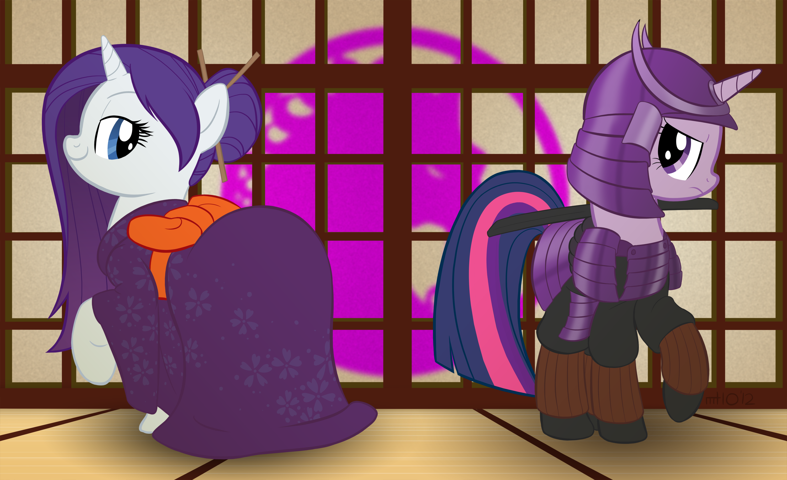

# SAMURAAAAI

## A Note

All right, I accidentally nuked this file while trying to rename it. Oops. I updated my bashrc so that shit doesn't happen again. Anyhow, these notes are from the amazing Marissa Sashihara.

Also, some images that weren't nuked with the quotes from Professor Leupp that spawned them.

> There were only 6 breeds of horse in feudal Japan, all ponies. As a result, samurai became experts with ponies and small mounts until Arabians were introduced. by the Dutch.

> Japanese samurai carried swords that were the finest in the world. Not only were they lethal, but also beautiful. However, since the samurai emphasized archery, they rarely were used in battle.

> As time went on, these two seperate Japanese cultures, the aristocratic lifestyle and the way of the samurai, grew apart and began to mistrust each other.

I'm amazed how oddly relevant this image from 2 years ago is...

## Marissa's Notes (Sorry for the lack of MD formatting)

-pinnacle of jap literature achievement

Murasaki Shikibu (Shikibu refers to her rank) don’t know her actual name (ca 1000)

·      Wrote Tale of Genji

·      Book bout a second wife that was beloved by the emperor greater than the first wife, and as she returns the council plans for her to get locked in the corridor and is humiliated and dies, she gives birth before dying to boy named Genji

o   Theme of novel: destructive impact of women’s hostility to eachother

o   Genji had a lot of amorous connections, become married to daughter of minister of left, but seduces many women, author described his behavior was a positive aristocratic behavior.

§  He seems to be the model male in hein literature

Torikarbaya- unusual novel, about aristocratic fam have son and daughter, boy identifies as female and girl identifies as male, male is maiden and impregnates princess, daughter becomes a guard and a man and guard becomes pregnant.

Sarashima- lists of how things should happen, how men should act after sex etc

The Girl Who Loved Insects- rebelled. She wanted to be more natural and interested with insects. Aristocrat men send her poem cause they find her weird but attractive.  The aristocrats send her a mechanical snake

·      Another look at gender role protest

RISE of the SAMURAI CLASS 1185 they became ruling class

·      From the verb saburau

·      Bushi

o   Bu= military. martial

o   Shi= gentlemen

·      Ritsu ryo code established a military conscription system – peasants along with duty to provide rice they were also expected to participate in labor (construction or defense of frontier)

o   This gradually collapses (largely due to peasant resistance)

·      Some powerful Uji never opted for court life but retained or acquired bases on power in the provinces

·      Private armies used to push back Emishi suppress rebellions

o   Led by people who weren’t needed at court were dispatched to provinces where they headed bands of local warriors to serve court

o   Weapons:

§  swords: superb sword-smithing techniques

ú  Steel swords

ú  Major trade item with china during ming dynasty (1388-1644) considered superior to chinese

ú  Regarded by eurpoens in the 16th century as best in the world

ú  Swords very ornamented as samuri rose in status and acquired more wealth

§  Other weapons: naginata and yari (spear)

§  Archery was central and key

ú  The way of the samuri. Most important

ú  Now in jap eents of mounted archery

ú  Horses from prehistoric times, but few, more from 4th century

ú  8 native breeds (all ponies), portugues didn’t have high regard to jap horses

o   Amor of horse riding samurai

§  Had tight woven silk instead of steel breast plates, if shot you can putt the tunic and get arror out and its light weight

§  Emergence of Prominent Warriors Families

ú  Bushi= warriors

ú  Buke= military families

·      Abe

·      Tachibana

·      Fujiwara

·      Taira or Heike

·      Minamoto or Genji

·      Shoen (estates)

o   Why did the samuri class emerge (princply from the ownership of private property)

§  Used to be surveyers that gave each person a certain amt of land and that system worked from 200 yrs but estates are awarded to Buddhist temples for upkeep. Over time, the temples comes to acquire estates all over country and then lands fall into hands of samurai. Maybs bc of gov neglect, these fams weren’t challenged

§  Peasents were assigned part of land and expected to always stay and work on it

o   Why did the ritsu-ryo land system decline?

§  Simply unsuitable for an unsophisticated society?

ú  Wasn’t a literate class to keep records

§  Overpopulation and not enough land (Yamanura)? peasants hatred of taxation – this turns out to be wrong

§  Epidemics (Ferris)? –demographic crisis due to small pox/malaria

o   Levels of Land Ownership

§  From honke (“commend the land” give you my land in exchange for protection) to ryoke (owner) to (estate) manager who resides there on property to tiller

o   Different lifestyle and ethos

§  Two contrastic classes:

§  Kuge

ú  Aesthetic pursuits

ú  High level of female autonomy

ú  Adultery seldom punished seriously

ú  Homosexuality mentioned in sources occasionally

§  Buke

ú  Martial training

ú  Women more subject to patriarchal authority

ú  Female infidelity punished

ú  Male homosexual relations very common in samurai

ú  “warrior code” – emphasizing feudal loyalty to ones master
